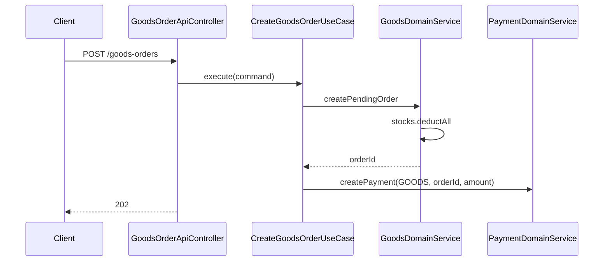
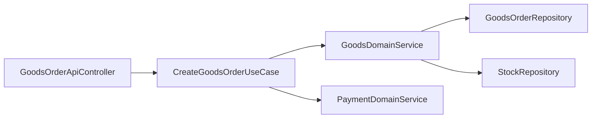

# [GOODS-05] GoodsOrder Entity + 주문 UseCase + 재고 차감

## 작업 내용 (설계 의도)

### 변경 사항

`GoodsOrder`, `GoodsOrderItem`, `GoodsOrderStatus` enum 추가. status: PENDING / CONFIRMED / CANCELLED / SHIPPED / DELIVERED.

`POST /goods-orders` — 장바구니 또는 직구매 페이로드로 주문 생성.

`CreateGoodsOrderUseCase` 흐름:
1. `GoodsDomainService.createPendingOrder(userId, items)` — Stock.deduct를 각 아이템에 호출(트랜잭션 내). 재고 부족이면 `OutOfStockException` 전체 롤백.
2. PaymentDomainService.create 호출.
3. 202 Accepted + orderId.

Flyway `V9__goods_order.sql`로 `goods_orders`, `goods_order_items` 테이블.

## 다이어그램

### 처리 흐름

### 클래스 의존

## 테스트 케이스

### 단위 테스트 (Unit)
| ID | 대상 | 케이스 |
|---|---|---|
| U-01 | `CreateGoodsOrderUseCase` | 빈 items 입력 시 `EmptyOrderException`을 던진다 |
| U-02 | `CreateGoodsOrderUseCase` | 총액은 서버 계산(`Σ price × quantity`)을 사용한다 |
| U-03 | `CreateGoodsOrderUseCase` | INACTIVE 상품 포함 시 트랜잭션 시작 전 `ProductInactiveException`으로 차단한다 |

### 레포지토리 테스트 (Repository / Persistence)
| ID | 대상 | 케이스 |
|---|---|---|
| R-01 | 트랜잭션 롤백 | 3아이템 중 1건 Stock 부족 시 전체 롤백되어 Stock·Order 변화 없다 |
| R-02 | 원자성 | GoodsOrder + Items + Stock 차감이 단일 트랜잭션 내 원자적으로 처리된다 |
| R-03 | 행 잠금 | 동시 두 트랜잭션이 같은 Stock 차감 시 행 잠금으로 직렬화되어 over-sell이 방지된다 |

### 시나리오 테스트 (Scenario / Integration)
| ID | 시나리오 | 케이스 |
|---|---|---|
| S-01 | 장바구니 주문 흐름 | 장바구니 → POST /goods-orders → Payment.create → 202 + orderId 흐름이 완료된다 |
| S-02 | 직구매 | 장바구니 미경유 직구매도 동일 API로 처리된다 |
| S-03 | 경계 0 | 재고 0 도달 후 다음 주문은 OutOfStockException으로 차단된다 |
