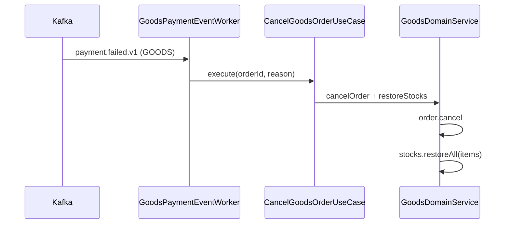
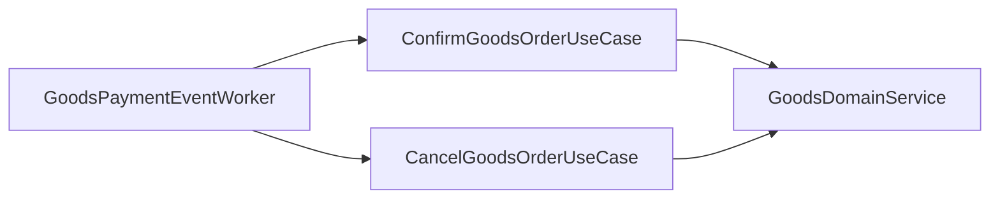

# [GOODS-06] payment.completed/failed consumer → 재고 보상

## 작업 내용 (설계 의도)

### 변경 사항

`presentation/consumer/GoodsPaymentEventWorker`에서 `payment.completed.v1` / `payment.failed.v1` (orderType=GOODS) 구독.

`payment.completed.v1`: `ConfirmGoodsOrderUseCase` → GoodsOrder.confirm + 장바구니 해당 아이템 제거.

`payment.failed.v1`: `CancelGoodsOrderUseCase` → GoodsOrder.cancel + **Stock.restore**(보상). 재고는 주문 생성 시 차감했으므로 결제 실패 시 복원 필수.

멱등성: GoodsOrder.status가 이미 CONFIRMED/CANCELLED면 noop.

## 다이어그램

### 처리 흐름

### 클래스 의존

## 테스트 케이스

### 단위 테스트 (Unit)
| ID | 대상 | 케이스 |
|---|---|---|
| U-01 | `CancelGoodsOrderUseCase` | GoodsOrder.cancel + 각 OrderItem만큼 Stock.restore를 호출한다 (MockK) |
| U-02 | `CancelGoodsOrderUseCase` | 이미 CANCELLED 상태 주문 재호출 시 Stock이 이중 복원되지 않는다 |
| U-03 | `GoodsPaymentEventWorker` | orderType ≠ GOODS 이벤트는 무시한다 |

### 레포지토리 테스트 (Repository / Persistence)
| ID | 대상 | 케이스 |
|---|---|---|
| R-01 | 보상 트랜잭션 | GoodsOrder + 모든 OrderItem Stock 복원이 단일 트랜잭션으로 처리된다 |
| R-02 | Consumer 동시 처리 | 두 인스턴스가 같은 이벤트 처리해도 Stock이 1회만 복원된다 |

### 시나리오 테스트 (Scenario / Integration)
| ID | 시나리오 | 케이스 |
|---|---|---|
| S-01 | 결제 실패 보상 | Stock -3 차감 → `payment.failed.v1` → 5초 내 Stock +3 복원된다 |
| S-02 | 결제 완료 확정 | `payment.completed.v1` 수신 시 CONFIRMED 전이 + 장바구니 아이템 자동 제거 |
| S-03 | 멱등성 | 동일 이벤트 두 번 발행해도 한 번만 처리된다 |
