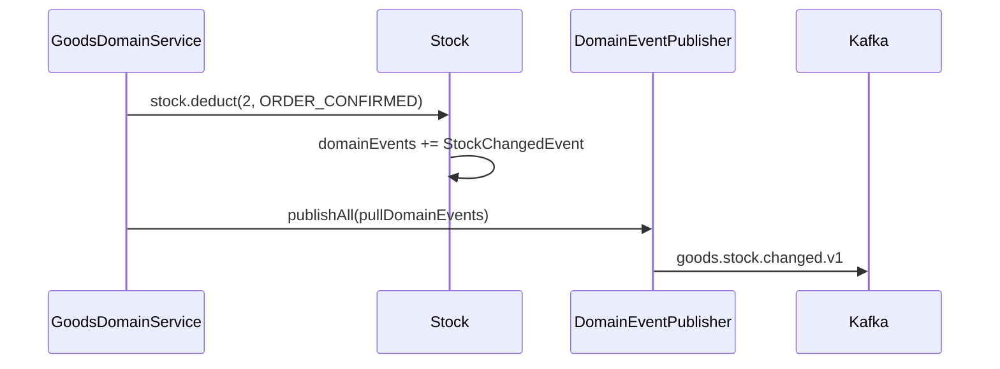
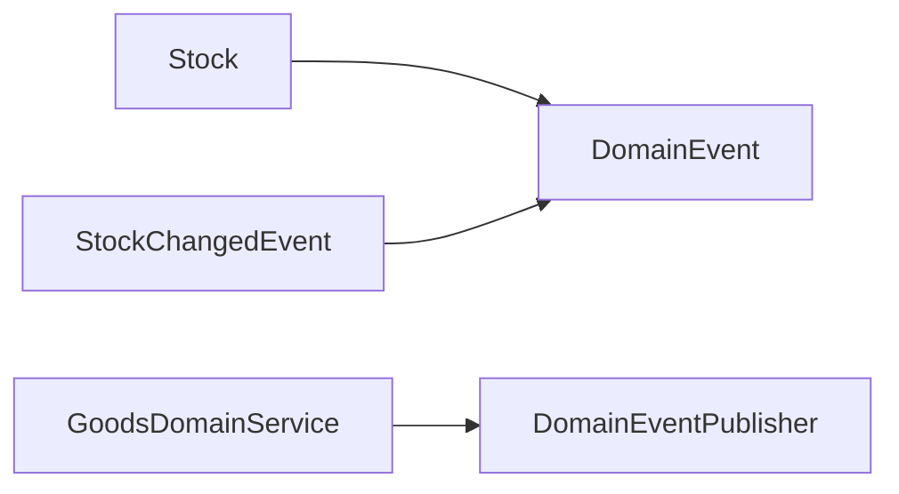

# [GOODS-07] goods.stock.changed 이벤트 발행

## 작업 내용 (설계 의도)

### 변경 사항

`Stock.deduct` / `Stock.restore` 호출 시 Entity 내부에 `StockChangedEvent`를 적재.

GoodsDomainService가 `DomainEventPublisher.publishAll`로 발행 → `goods.stock.changed.v1` 토픽.

페이로드: `{ productId, delta, reason, occurredAt }`. reason은 ORDER_CONFIRMED / ORDER_CANCELLED / MANUAL_ADJUST 등 enum.

용도:
1. 인기 상품 캐시 invalidate (GOODS-03).
2. 향후 분석 트랙(별도 PRD)에서 재고 추적용.
3. Notification 도메인이 시청 중 상품 재입고 알림 트리거(V2).

## 다이어그램

### 처리 흐름

### 클래스 의존

## 테스트 케이스

### 단위 테스트 (Unit)
| ID | 대상 | 케이스 |
|---|---|---|
| U-01 | `Stock.deduct` | `StockChangedEvent(productId, -2, ORDER_CONFIRMED)`가 적재된다 |
| U-02 | `Stock.restore` | `StockChangedEvent(productId, +2, ORDER_CANCELLED)`가 적재된다 |
| U-03 | `Stock.pullDomainEvents` | 호출 후 내부 리스트가 비워진다 |

### 레포지토리 테스트 (Repository / Persistence)
| ID | 대상 | 케이스 |
|---|---|---|
| R-01 | AFTER_COMMIT 발행 | Stock UPDATE 트랜잭션 커밋 후에만 토픽 발행이 일어나고 롤백 시 발행되지 않는다 |
| R-02 | 다수 변경 발행 | 동일 트랜잭션의 다수 Stock 변경 시 각 이벤트가 모두 발행된다 |

### 시나리오 테스트 (Scenario / Integration)
| ID | 시나리오 | 케이스 |
|---|---|---|
| S-01 | 차감 이벤트 | 주문 Stock 차감 후 `goods.stock.changed.v1` 페이로드(productId, delta, reason, occurredAt)가 정확하다 |
| S-02 | 캐시 invalidate 연동 | consumer 측 인기 상품 캐시 invalidate가 정상 동작한다 |
| S-03 | 복원 추적 | Stock 복원 이벤트도 별도 발행되어 분석 트랙에서 추적 가능하다 |
