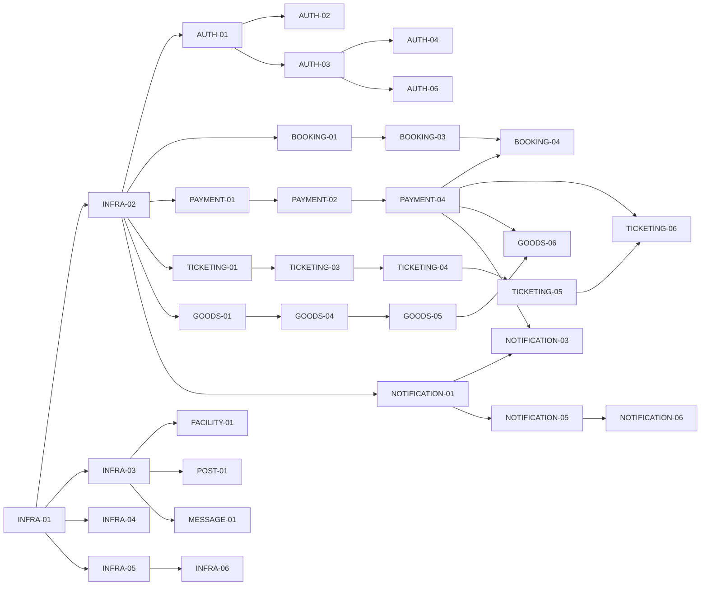

# 티켓 인덱스

> PRD: [sports-application-prd.md](../prd/sports-application-prd.md)
> 레거시 분석: [MyLifeSports.md](../legacy-analysis/MyLifeSports.md)

## 분해 원칙

- 1티켓 = 1책임 = 1일 = 1PR
- 도메인이 다르면 티켓도 분리
- 후행 의존 ≥ 3인 티켓은 공통 산출물로 추출
- 같은 wave 내 동일 파일 수정 금지

## 카테고리별 티켓 목록

### INFRA — 공통 인프라 (M0)
| ID | 제목 | 의존 |
|---|---|---|
| INFRA-01 | Spring Boot 모놀리스 부트스트랩 | — |
| INFRA-02 | MySQL 스키마·Flyway 마이그레이션 골격 | INFRA-01 |
| INFRA-03 | MongoDB·Spring Data 설정 | INFRA-01 |
| INFRA-04 | Redis 설정 (분산 락 헬퍼 포함) | INFRA-01 |
| INFRA-05 | Kafka 설정 (Producer/Consumer 공통 빈) | INFRA-01 |
| INFRA-06 | 공통 도메인 이벤트 추상 + DomainEventPublisher | INFRA-01, INFRA-05 |
| INFRA-07 | 공통 예외 처리 + ProblemDetail 응답 | INFRA-01 |

### AUTH — User/Auth (M1)
| ID | 제목 | 의존 |
|---|---|---|
| AUTH-01 | User Entity + Role/Permission 도메인 | INFRA-02 |
| AUTH-02 | 회원 가입 UseCase + API | AUTH-01 |
| AUTH-03 | 로그인·JWT 발급 + Refresh Token | AUTH-01, INFRA-04 |
| AUTH-04 | 로그아웃 + Redis 블랙리스트 | AUTH-03 |
| AUTH-05 | Role 부여·회수 ADMIN API | AUTH-01 |
| AUTH-06 | `@PreAuthorize` 메서드 보안 와이어업 | AUTH-03, AUTH-05 |

### FACILITY — 시설 (M2)
| ID | 제목 | 의존 |
|---|---|---|
| FACILITY-01 | Facility 도메인 + Mongo 컬렉션 | INFRA-03 |
| FACILITY-02 | 시설 전체·자치구·유형 조회 API | FACILITY-01 |
| FACILITY-03 | 시설 단건 + 조합 통계 API | FACILITY-01 |
| FACILITY-04 | 레거시 maps 데이터 1회 이관 스크립트 | FACILITY-01 |

### BOOKING — 시설 예매 (M3)
| ID | 제목 | 의존 |
|---|---|---|
| BOOKING-01 | Slot·Booking Entity + 도메인 | INFRA-02 |
| BOOKING-02 | Slot 등록/조회 API (Owner) | BOOKING-01, AUTH-06 |
| BOOKING-03 | 예약 신청 UseCase + Redis 분산 락 | BOOKING-01, INFRA-04 |
| BOOKING-04 | 예약 취소 UseCase + Saga 보상 consumer | BOOKING-03, INFRA-05 |
| BOOKING-05 | 사용자별 예약 목록 + 단건 조회 API | BOOKING-01 |

### PAYMENT — 결제 (M4)
| ID | 제목 | 의존 |
|---|---|---|
| PAYMENT-01 | Payment Entity + 멱등 키 + 도메인 | INFRA-02 |
| PAYMENT-02 | 결제 생성 UseCase + API | PAYMENT-01 |
| PAYMENT-03 | PG 어댑터 mock 구현 (Gateway interface) | PAYMENT-01 |
| PAYMENT-04 | payment.completed/failed Kafka 발행 | PAYMENT-02, INFRA-06 |
| PAYMENT-05 | 결제 조회 API (단건·사용자별) | PAYMENT-01 |

### TICKETING — 경기 티켓 (M5)
| ID | 제목 | 의존 |
|---|---|---|
| TICKETING-01 | Event·Seat Entity + 도메인 | INFRA-02 |
| TICKETING-02 | 경기 목록·단건 조회 API | TICKETING-01 |
| TICKETING-03 | Ticket·TicketOrder Entity + 도메인 | TICKETING-01 |
| TICKETING-04 | 좌석 선택 UseCase + Redis 5분 락 | TICKETING-03, INFRA-04 |
| TICKETING-05 | 티켓 구매 UseCase + Payment 호출 | TICKETING-04, PAYMENT-02 |
| TICKETING-06 | payment.completed consumer → 티켓 발권 | TICKETING-05, PAYMENT-04 |
| TICKETING-07 | 사용자 보유 티켓 조회 API | TICKETING-03 |

### GOODS — 스포츠 물품 (M6)
| ID | 제목 | 의존 |
|---|---|---|
| GOODS-01 | Product·Stock Entity + 도메인 | INFRA-02 |
| GOODS-02 | 상품 카테고리·키워드 검색 API | GOODS-01 |
| GOODS-03 | 인기 상품 Redis 캐시 | GOODS-01, INFRA-04 |
| GOODS-04 | Cart Entity + Cart UseCase + API | GOODS-01 |
| GOODS-05 | GoodsOrder Entity + 주문 UseCase + 재고 차감 | GOODS-04, PAYMENT-02 |
| GOODS-06 | payment.completed/failed consumer → 재고 보상 | GOODS-05, PAYMENT-04 |
| GOODS-07 | goods.stock.changed 이벤트 발행 | GOODS-05, INFRA-06 |

### POST — 게시판 (M7)
| ID | 제목 | 의존 |
|---|---|---|
| POST-01 | Post·Comment Mongo 컬렉션 + 도메인 (분리 모델) | INFRA-03 |
| POST-02 | 게시글 생성·삭제 API | POST-01 |
| POST-03 | 게시글 조회 (목록·유형·사용자·키워드) | POST-01 |
| POST-04 | 댓글 작성·삭제 API | POST-01 |

### MESSAGE — 채팅 (M7)
| ID | 제목 | 의존 |
|---|---|---|
| MESSAGE-01 | Room·Message Mongo 컬렉션 + 도메인 (분리 모델) | INFRA-03 |
| MESSAGE-02 | 채팅방 생성·삭제·조회 API | MESSAGE-01 |
| MESSAGE-03 | 메시지 작성 + 채팅방 목록·키워드 검색 API | MESSAGE-01 |

### NOTIFICATION — 알림 (M8)
| ID | 제목 | 의존 |
|---|---|---|
| NOTIFICATION-01 | Notification Entity + Channel Gateway 추상 | INFRA-02 |
| NOTIFICATION-02 | 인앱 채널 구현 + 단건 조회 API | NOTIFICATION-01 |
| NOTIFICATION-03 | payment.completed / booking.confirmed / ticket.issued consumer | NOTIFICATION-01, INFRA-06 |
| NOTIFICATION-04 | 알림 템플릿 렌더링 + 발송 UseCase | NOTIFICATION-01 |
| NOTIFICATION-05 | 모바일 푸시 토큰 등록·해제 API | NOTIFICATION-01, AUTH-03 |
| NOTIFICATION-06 | Expo Push Service Gateway 구현 | NOTIFICATION-01, NOTIFICATION-05 |

### WEB — Next.js 14 웹 클라이언트 (M-Web)
| ID | 제목 | 의존 |
|---|---|---|
| WEB-01 | Next.js 14 부트스트랩 + BFF 골격 | (Web 단독) |
| WEB-02 | 가입·로그인·로그아웃 화면 + BFF | WEB-01, AUTH-02·03 |
| WEB-03 | 시설 검색·단건 화면 | WEB-01, FACILITY-02·03 |
| WEB-04 | 시설 예매 화면 + 결제 흐름 | WEB-02, BOOKING-03 |
| WEB-05 | 경기 목록·좌석맵·티켓 구매 화면 | WEB-02, TICKETING-04·05 |
| WEB-06 | 상품 목록·장바구니·주문 화면 | WEB-02, GOODS-02·04·05 |
| WEB-07a | 마이페이지 — 예약 목록 | WEB-04, BOOKING-05 |
| WEB-07b | 마이페이지 — 티켓 목록 | WEB-05, TICKETING-07 |
| WEB-07c | 마이페이지 — 주문 목록 | WEB-06 |
| WEB-07d | 마이페이지 — 알림 목록·뱃지 | WEB-02, NOTIFICATION-02 |
| WEB-08 | 관리자/Owner 어드민 화면 | WEB-02, AUTH-05·06 |
| WEB-09 | 접근성(a11y) + 번들 예산 + 공통 컴포넌트 정리 | WEB-01 |

> WEB-07은 4개 도메인 의존(fan-in=5)으로 직선형 wave를 만들기에 도메인별 4개(07a~07d)로 쪼개 병렬 가능하게 분해. 각 티켓이 자기 도메인 BE 티켓 완료 직후 시작 가능.

### MOBILE — React Native + Expo 모바일 앱 (M-Mobile)
| ID | 제목 | 의존 |
|---|---|---|
| MOBILE-01 | RN 0.74 + Expo 51 부트스트랩 | (Mobile 단독) |
| MOBILE-02 | 가입·로그인 화면 + JWT SecureStore | MOBILE-01, AUTH-02·03 |
| MOBILE-03 | 시설 검색 + 위치 기반 추천 화면 | MOBILE-01, FACILITY-02 |
| MOBILE-04 | 시설 단건 + 지도 + 예약 흐름 | MOBILE-02, BOOKING-03 |
| MOBILE-05 | 경기 단건 + 좌석맵 + 티켓 구매 화면 | MOBILE-02, TICKETING-04·05 |
| MOBILE-06 | 상품 검색·장바구니·주문 화면 | MOBILE-02, GOODS-02·04·05 |
| MOBILE-07 | 마이페이지 탭 (예약/티켓/주문/알림) | MOBILE-04·05·06, NOTIFICATION-02 |
| MOBILE-08 | Expo 푸시 알림 + 딥링크 라우팅 | MOBILE-02, NOTIFICATION-05·06 |
| MOBILE-09 | 오프라인 처리 + 성능 메트릭 | MOBILE-01 |

## 의존 그래프 (마일스톤별 위상정렬)

**Fan-out 핵심**: PAYMENT-04(`payment.completed/failed.v1` 발행)가 Booking·Ticketing·Goods·Notification 4개 consumer 티켓의 공통 선행. 의존 ≥ 3이지만 발행/구독 분리에 따른 필연적 병목으로 추가 분할 불필요.

총 티켓 수: **75건** (검수 반영 후)
- BE 54건 (INFRA 7 + AUTH 6 + FACILITY 4 + BOOKING 5 + PAYMENT 5 + TICKETING 7 + GOODS 7 + POST 4 + MESSAGE 3 + **NOTIFICATION 6**)
- Web 12건 (WEB-01~06 + **WEB-07a~07d** + WEB-08~09)
- Mobile 9건 (MOBILE-01 ~ MOBILE-09)

### 검수 반영 (2026-05-19)

| 변경 | 사유 |
|---|---|
| NOTIFICATION-05 신설 | 모바일 push token 등록/해제 API (C3) |
| NOTIFICATION-06 신설 | Expo Push Gateway 구현 (C4) |
| WEB-07 → WEB-07a~07d 분할 | fan-in 5 직선형 wave 해소 (M6) |
| TICKETING-03/06 강화 | DB 부분 unique + payment.failed 락 해제 (C1, C2) |
| BOOKING-03 리팩터 | 락 호출을 DomainService 내부로 (M1, be-code-convention) |
| `ticket.issued.v1` 페이로드 보강 | seats[] 포함 (M2) |
| `payment.requested.v1` 제거 | 사용처 없음 (M3) |
| GOODS 재고 정책 명확화 | "PENDING 시 차감 + 실패 시 보상" 명시 (M4) |
