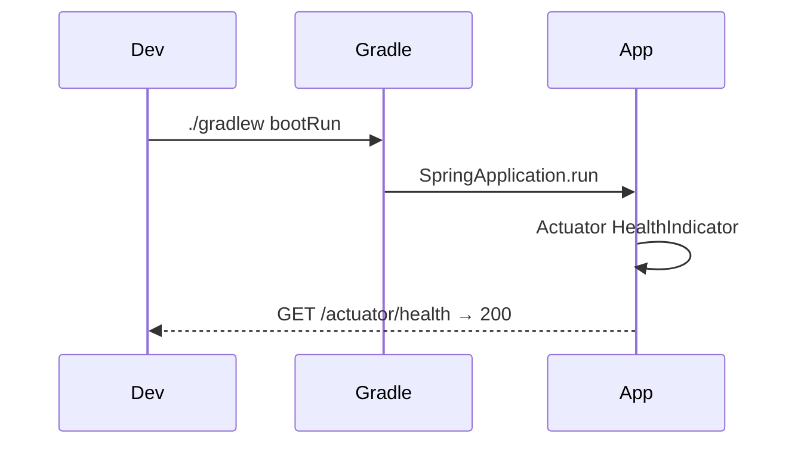
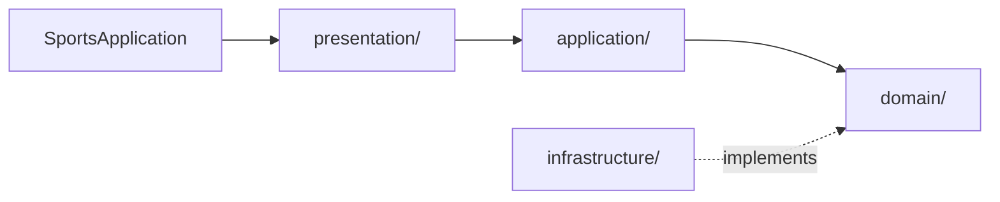

# [INFRA-01] Spring Boot 모놀리스 부트스트랩

## 작업 내용 (설계 의도)

### 변경 사항

신규 `sports-application` 모놀리스의 골격을 만든다. Kotlin 1.9 + Spring Boot 3.x + Gradle Kotlin DSL로 단일 모듈 구조를 잡고, 도메인 패키지(`domain.user`, `domain.booking`, …)를 빈 상태로 미리 분리해 후속 티켓이 충돌 없이 병렬 진입할 수 있게 한다.

Hexagonal 4레이어(`presentation` / `application` / `domain` / `infrastructure`) 디렉토리만 만들고 비즈니스 코드는 들이지 않는다. 헬스 체크(`/actuator/health`)만 동작하면 완료.

`harness-rules.json`을 빌드에 연결해 PR 시 정적 검증이 작동하도록 한다.

## 다이어그램

### 처리 흐름

### 클래스 의존

## 테스트 케이스

### 단위 테스트 (Unit)
| ID | 대상 | 케이스 |
|---|---|---|
| U-01 | ArchUnit `LayerDependencyRules` | domain 패키지는 infrastructure를 import하지 않는다 |
| U-02 | ArchUnit `PackageStructureRules` | presentation/application/domain/infrastructure 4개 패키지가 존재한다 |
| U-03 | `HarnessRulesCheck` | 빈 모듈에 대해 detekt harness-rules 위반이 0건이다 |

### 레포지토리 테스트 (Repository / Persistence)
| ID | 대상 | 케이스 |
|---|---|---|
| R-01 | — | 본 티켓 단계에는 Repository가 없어 해당 없음 |

### 시나리오 테스트 (Scenario / Integration)
| ID | 시나리오 | 케이스 |
|---|---|---|
| S-01 | 부팅 메인 플로우 | SpringBootTest 컨텍스트 로드 후 `GET /actuator/health`가 200 + `{"status":"UP"}`을 반환한다 |
| S-02 | 잘못된 설정 부팅 | 알 수 없는 `application.yml` 키로 시작하면 명확한 부팅 실패 메시지를 출력한다 |
