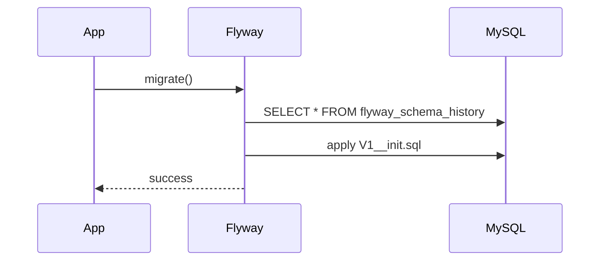
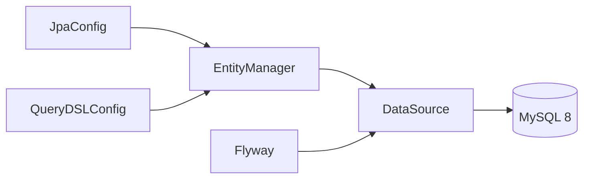

# [INFRA-02] MySQL 스키마·Flyway 마이그레이션 골격

## 작업 내용 (설계 의도)

### 변경 사항

MySQL 8 단일 스키마를 정의하고 Flyway로 버전 관리한다. `V1__init.sql`은 빈 베이스라인이며, 후속 티켓(AUTH-01, BOOKING-01 등)이 자기 도메인 테이블을 별도 마이그레이션으로 추가한다.

QueryDSL JPA를 와이어업한다. `@Query` 사용 금지(harness-rules). 복잡 쿼리는 `CustomRepository` 인터페이스 + `RepositoryImpl`에서 QueryDSL로 표현한다.

JPA 글로벌 설정에 `hibernate.jdbc.time_zone=UTC`, `physical_naming_strategy=SnakeCaseStrategy`를 강제한다. Entity PK는 `id: Long`으로 통일한다.

## 다이어그램

### 처리 흐름

### 클래스 의존

## 테스트 케이스

### 단위 테스트 (Unit)
| ID | 대상 | 케이스 |
|---|---|---|
| U-01 | `ZonedDateTimeAttributeConverter` | UTC 기준 ZonedDateTime ↔ TIMESTAMP 변환이 라운드트립에서 instant를 보존한다 |
| U-02 | `SnakeCaseStrategy` | `userId` 프로퍼티가 `user_id` 컬럼명으로 변환된다 |
| U-03 | `QueryDslConfig` | `JPAQueryFactory` 빈이 EntityManager를 정확히 주입받는다 |

### 레포지토리 테스트 (Repository / Persistence)
| ID | 대상 | 케이스 |
|---|---|---|
| R-01 | Flyway | 빈 베이스라인 `V1__init.sql` 적용 후 `flyway_schema_history`에 1행이 정확히 적재된다 |
| R-02 | `JPAQueryFactory` | 빈 결과 쿼리가 예외 없이 빈 리스트를 반환한다 |
| R-03 | detekt 정적 룰 | `@Query` 어노테이션 사용 시 빌드가 실패한다 |

### 시나리오 테스트 (Scenario / Integration)
| ID | 시나리오 | 케이스 |
|---|---|---|
| S-01 | Testcontainers MySQL 부팅 | 컨테이너 기동 후 애플리케이션이 30초 내 부팅 완료되고 schema_history가 생성된다 |
