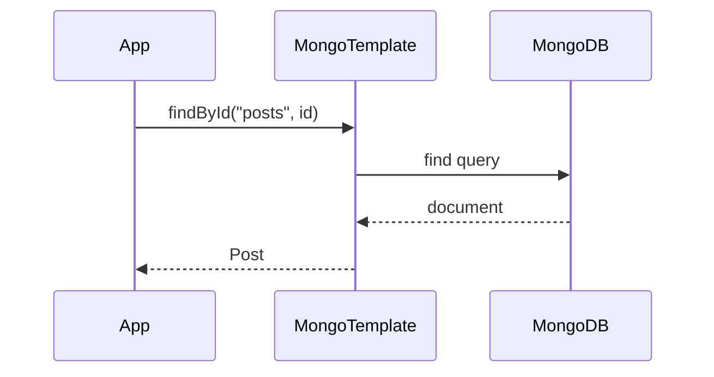
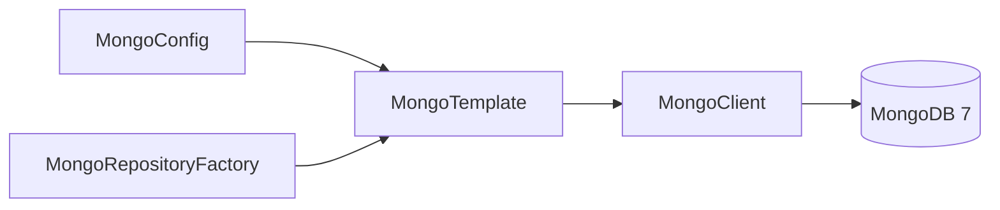

# [INFRA-03] MongoDB·Spring Data 설정

## 작업 내용 (설계 의도)

### 변경 사항

MongoDB 7을 비정형·비트랜잭션 도메인(Facility, Post, Comment, Message, Room) 전용으로 설정한다. Spring Data MongoDB의 `MongoTemplate`과 `MongoRepository`를 동시에 사용 가능하게 한다.

연결 정보·DB 이름은 `application.yml`의 `spring.data.mongodb.*`로 외부 주입한다. 평문 커밋 금지. 로컬은 docker-compose, 운영은 시크릿 매니저.

도큐먼트 명명 규약: `@Document(collection = "posts")`처럼 복수형 snake_case. 인덱스는 후속 도메인 티켓에서 `@CompoundIndex` / `@TextIndexed`로 선언.

## 다이어그램

### 처리 흐름

### 클래스 의존

## 테스트 케이스

### 단위 테스트 (Unit)
| ID | 대상 | 케이스 |
|---|---|---|
| U-01 | `MongoCustomConversions` | ZonedDateTime ↔ Date 컨버터가 zone 정보 손실 없이 변환한다 |
| U-02 | `MongoConfig` | trusted.packages 화이트리스트 외 패키지의 DTO 역직렬화는 거부된다 |

### 레포지토리 테스트 (Repository / Persistence)
| ID | 대상 | 케이스 |
|---|---|---|
| R-01 | `MongoTemplate` | save → findById 라운드트립으로 도큐먼트 필드가 정확히 보존된다 |
| R-02 | `@CompoundIndex` | 인덱스 자동 생성 활성화 시 어노테이션이 실제 인덱스로 생성된다 |

### 시나리오 테스트 (Scenario / Integration)
| ID | 시나리오 | 케이스 |
|---|---|---|
| S-01 | 부팅 라운드트립 | Testcontainers MongoDB 기동 후 MongoTemplate 빈이 주입되고 ping 응답이 성공한다 |
| S-02 | 시크릿 노출 방지 | `application.yml`에 평문 mongodb URI가 커밋되면 pre-commit hook이 거부한다 |
