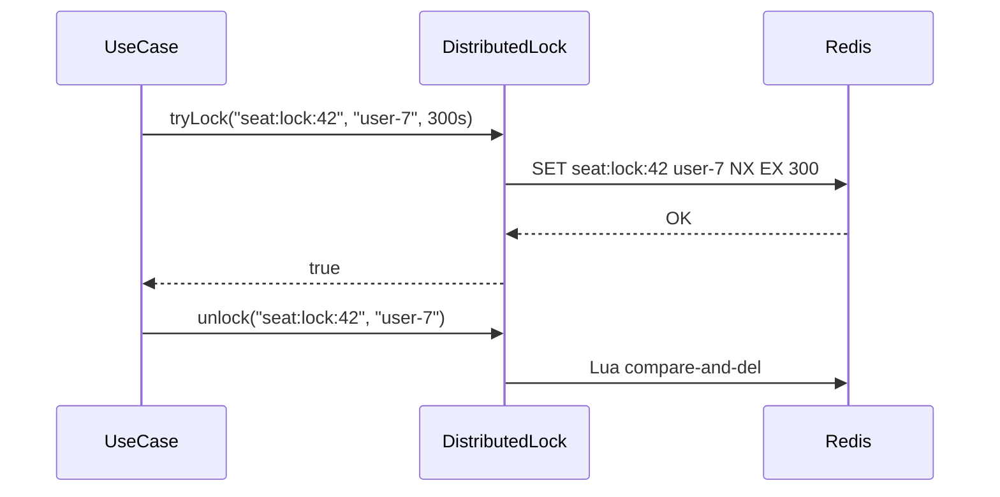
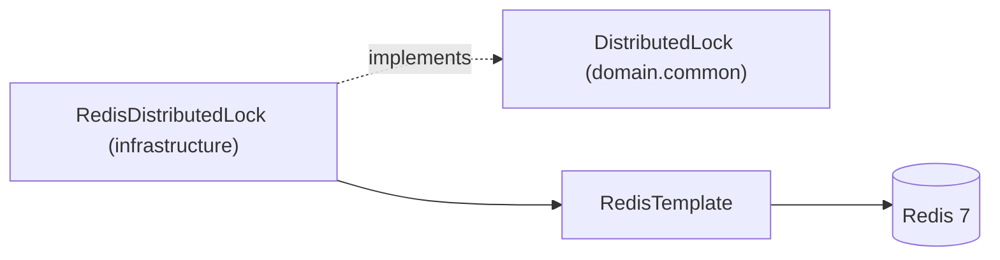

# [INFRA-04] Redis 설정 (분산 락 헬퍼 포함)

## 작업 내용 (설계 의도)

### 변경 사항

Redis 7을 캐시·세션·분산 락 용도로 설정한다. Spring Data Redis의 `RedisTemplate<String, String>`을 기본 빈으로 두고, 자주 쓰는 분산 락 유즈케이스를 추상화한 `DistributedLock` 인터페이스를 `domain.common`에 정의한다.

분산 락은 `SETNX key value EX ttl` 기반의 단순 구현. Redisson 같은 별도 라이브러리는 도입하지 않는다(필요 시 추후 교체).

좌석 점유 락(TICKETING-04), 예약 슬롯 락(BOOKING-03)에서 공통 사용한다.

## 다이어그램

### 처리 흐름

### 클래스 의존

## 테스트 케이스

### 단위 테스트 (Unit)
| ID | 대상 | 케이스 |
|---|---|---|
| U-01 | `DistributedLock` interface | tryLock은 boolean을 반환하고 value(소유자) 검증 콜백 시그니처를 만족한다 |
| U-02 | `RedisDistributedLock.unlock` | 보유자가 아니면 false를 반환하고 다른 사용자의 락은 해제하지 않는다 (MockK) |

### 레포지토리 테스트 (Repository / Persistence)
| ID | 대상 | 케이스 |
|---|---|---|
| R-01 | `RedisDistributedLock.tryLock` | 동일 키 동시 100건 중 1건만 true를 반환하고 99건은 false를 반환한다 |
| R-02 | `RedisDistributedLock.tryLock` | TTL 5초 락이 5초 경과 후 자동 해제되어 다음 tryLock이 성공한다 |
| R-03 | `RedisDistributedLock.unlock` | Lua 스크립트 기반 compare-and-del이 보유자 일치 시에만 키를 삭제한다 |

### 시나리오 테스트 (Scenario / Integration)
| ID | 시나리오 | 케이스 |
|---|---|---|
| S-01 | Redis 장애 | Redis 컨테이너 정지 시 tryLock 호출이 `RedisLockException`을 던지고 비즈니스 호출에 전파된다 |
