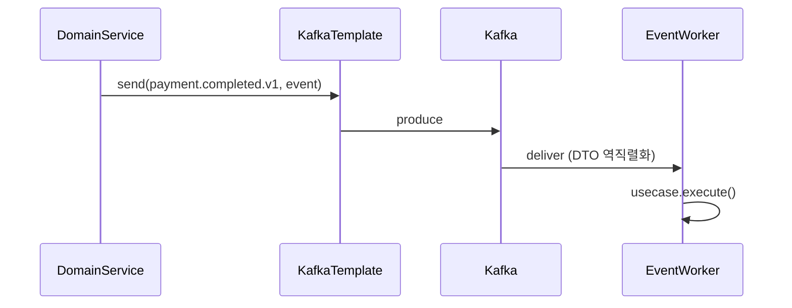
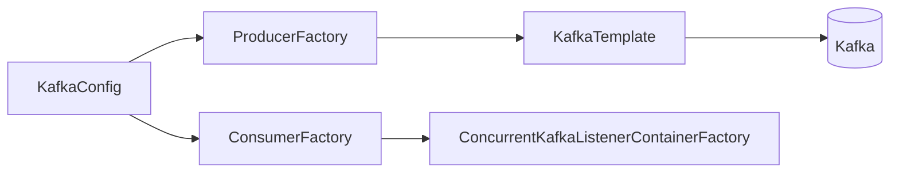

# [INFRA-05] Kafka 설정 (Producer/Consumer 공통 빈)

## 작업 내용 (설계 의도)

### 변경 사항

Kafka 3.x Producer/Consumer 공통 설정을 둔다. Serializer는 JSON 기반(`JsonSerializer`/`JsonDeserializer`) + `spring.json.trusted.packages` 화이트리스트.

**금지 사항**: `ConsumerRecord<String, String>` 사용 금지 (harness-rules). Consumer는 DTO를 직접 매핑한다.

토픽 명명: `<도메인>.<이벤트>.v<버전>` (예: `payment.completed.v1`). 토픽 자동 생성 비활성, 운영에는 별도 토픽 프로비저너 트랙으로 처리.

본 티켓에서는 빈만 등록한다. 토픽별 Producer/Consumer는 도메인 티켓이 가져다 쓴다.

## 다이어그램

### 처리 흐름

### 클래스 의존

## 테스트 케이스

### 단위 테스트 (Unit)
| ID | 대상 | 케이스 |
|---|---|---|
| U-01 | `JsonSerializer` | ZonedDateTime 필드가 ISO 8601 문자열로 직렬화된다 |
| U-02 | `JsonDeserializer` | trusted.packages 외 패키지 DTO 역직렬화 요청은 거부된다 |
| U-03 | detekt harness-rules | `ConsumerRecord<String, String>` 사용 시 빌드가 실패한다 |

### 레포지토리 테스트 (Repository / Persistence)
| ID | 대상 | 케이스 |
|---|---|---|
| R-01 | Testcontainers Kafka 라운드트립 | `test.topic.v1`에 DTO 발행 후 consumer가 동일 DTO로 역직렬화하여 수신한다 |
| R-02 | Consumer offset 보존 | 컨테이너 재시작 후에도 동일 그룹 consumer가 처리된 offset을 재처리하지 않는다 |

### 시나리오 테스트 (Scenario / Integration)
| ID | 시나리오 | 케이스 |
|---|---|---|
| S-01 | Kafka 장애 | 컨테이너 다운 후 발행 시 `KafkaTemplate`가 retry + backoff 후 명확한 예외를 던진다 |
