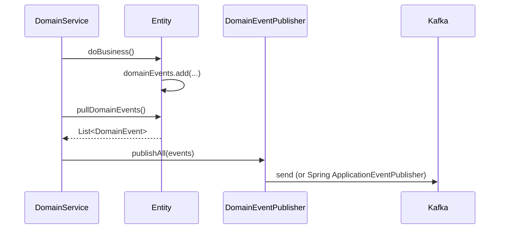
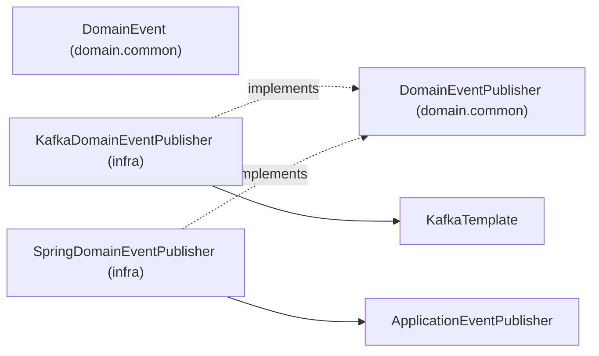

# [INFRA-06] 공통 도메인 이벤트 추상 + DomainEventPublisher

## 작업 내용 (설계 의도)

### 변경 사항

`domain.common`에 `DomainEvent` 추상 클래스와 `DomainEventPublisher` 인터페이스를 정의한다. Entity는 내부 `@Transient` 리스트에 이벤트를 적재하고, DomainService가 `publishAll(entity.pullDomainEvents())`로 일괄 발행한다.

`DomainEventPublisher` 구현은 둘:
1. `KafkaDomainEventPublisher` (infrastructure) — Kafka 발행 (외부 도메인 통신용)
2. `SpringDomainEventPublisher` (infrastructure) — `ApplicationEventPublisher` 위임 (모놀리스 내부 트랜잭션 이벤트용)

도메인 이벤트는 모놀리스 내부면 Spring, 외부면 Kafka로 발행한다. UseCase는 어디로 가는지 알 필요 없다.

## 다이어그램

### 처리 흐름

### 클래스 의존

## 테스트 케이스

### 단위 테스트 (Unit)
| ID | 대상 | 케이스 |
|---|---|---|
| U-01 | `AggregateRoot.pullDomainEvents` | 호출 후 내부 리스트가 비워지고 재호출 시 빈 리스트를 반환한다 |
| U-02 | `RoutingDomainEventPublisher` | `@KafkaEvent` 어노테이션이 있으면 Kafka, 없으면 Spring으로 라우팅된다 (MockK) |
| U-03 | `RoutingDomainEventPublisher` | topic 有/無 이벤트가 혼합된 publishAll 호출 시 Kafka/Spring 각 경로에 정확한 횟수만 위임된다 (topic: String? 이 binary 라 unknown routing 상태 없음) |

### 레포지토리 테스트 (Repository / Persistence)
| ID | 대상 | 케이스 |
|---|---|---|
| R-01 | `KafkaDomainEventPublisher.publishAll` | N개 이벤트가 모두 발행되고 각 페이로드가 정확히 매핑된다 |
| R-02 | `@TransactionalEventListener(AFTER_COMMIT)` | 트랜잭션 롤백 시 외부 발행이 일어나지 않는다 |

### 시나리오 테스트 (Scenario / Integration)
| ID | 시나리오 | 케이스 |
|---|---|---|
| S-01 | 도메인 → Kafka 라운드트립 | Entity 이벤트 적재 → publish → Kafka 도착이 5초 내 완료된다 |
| S-02 | 이중 경로 라우팅 | 내부 Spring 이벤트와 외부 Kafka 이벤트가 동시 적재 시 각 경로가 1회씩만 호출된다 |
