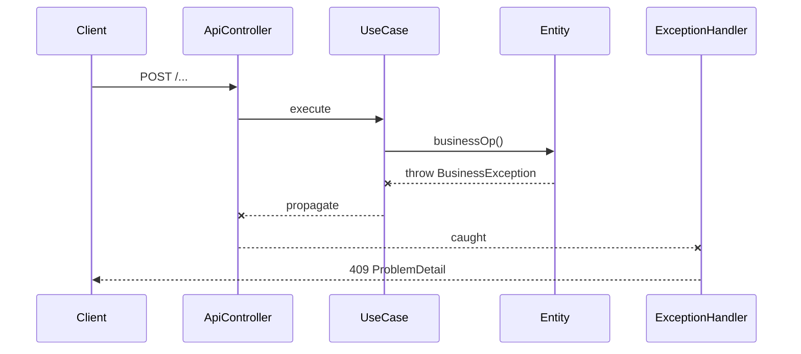
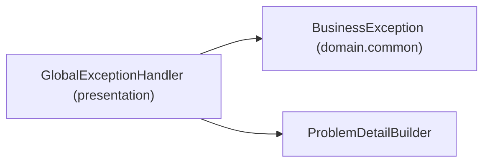

# [INFRA-07] 공통 예외 처리 + ProblemDetail 응답

## 작업 내용 (설계 의도)

### 변경 사항

`@RestControllerAdvice`로 전역 예외 핸들러를 둔다. 도메인 예외 베이스 `BusinessException(errorCode, message)`를 `domain.common`에 정의하고, presentation에서 RFC 7807 `ProblemDetail` 응답으로 변환한다.

도메인별 예외(`SelfRentalException`, `SeatAlreadyLockedException` 등)는 `BusinessException`을 상속한다. UseCase에서 `if + throw` 나열 금지 (harness-rules) — Entity 내부 캡슐화.

기본 응답 형식:
```json
{
  "type": "https://errors.sports-application/seat-locked",
  "title": "Seat already locked",
  "status": 409,
  "code": "SEAT_ALREADY_LOCKED",
  "detail": "seat 42 is locked by another user"
}
```

## 다이어그램

### 처리 흐름



### 클래스 의존



## 테스트 케이스

### 단위 테스트 (Unit)
| ID | 대상 | 케이스 |
|---|---|---|
| U-01 | `BusinessExceptionMapping` | 도메인 예외별 HTTP 상태 코드 매핑(404/409/422 등)이 정의된 표대로 동작한다 |
| U-02 | `ProblemDetailBuilder` | 응답 빌더가 type/title/status/code/detail 5개 필드를 항상 채운다 |
| U-03 | detekt harness-rules | UseCase 내부 `if + throw` 패턴 발생 시 빌드가 실패한다 |

### 레포지토리 테스트 (Repository / Persistence)
| ID | 대상 | 케이스 |
|---|---|---|
| R-01 | — | 본 티켓 단계에는 Repository가 없어 해당 없음 |

### 시나리오 테스트 (Scenario / Integration)
| ID | 시나리오 | 케이스 |
|---|---|---|
| S-01 | 도메인 예외 변환 | 의도적 `BusinessException` 발생 시 Controller가 정확한 ProblemDetail + 매핑된 HTTP 상태를 반환한다 |
| S-02 | 알 수 없는 예외 | RuntimeException은 500 + `INTERNAL_ERROR` 코드의 ProblemDetail로 변환된다 |
| S-03 | Bean Validation | `@Valid` 실패 시 422 + 필드별 에러 목록 포함 ProblemDetail이 반환된다 |
