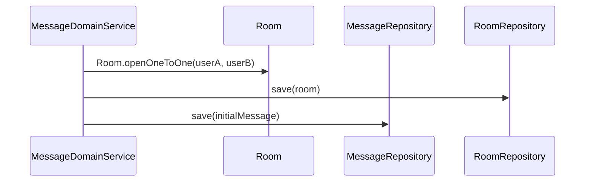
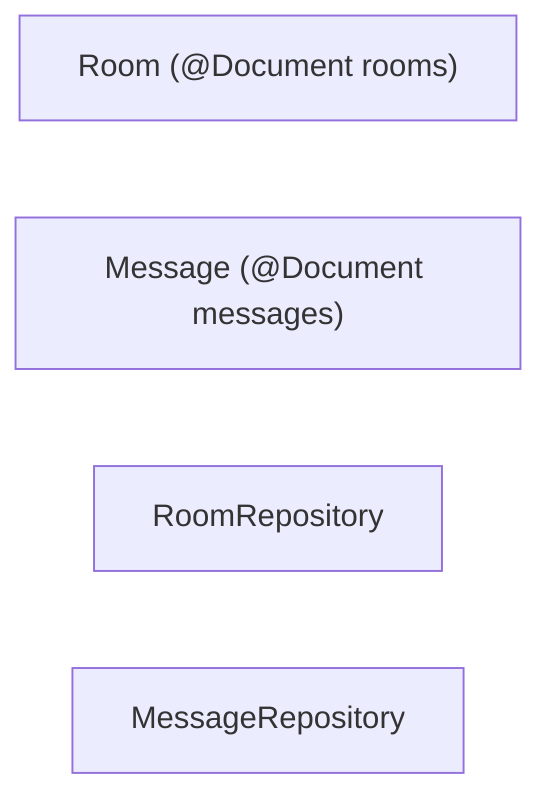

# [MESSAGE-01] Room·Message Mongo 컬렉션 + 도메인 (분리 모델)

## 작업 내용 (설계 의도)

### 변경 사항

`domain.message` 패키지에 `Room`, `Message`, `RoomRepository`, `MessageRepository`를 정의한다. 레거시는 Room에 messages 임베드였지만 본 PRD에서는 별도 컬렉션 분리 (16MB 한계 및 메시지 폭주 대응).

`Room`: `id`, `name`(nullable for 1:1), `participantIds[]`(MySQL User.id 리스트), `createdAt`, `lastMessageAt`(인덱스).
`Message`: `id`, `roomId`, `senderId`, `content`, `sentAt`(ZonedDateTime).

인덱스:
- rooms: `participantIds`, `lastMessageAt desc`.
- messages: `(roomId, sentAt desc)`.

`Room.addParticipant`, `Room.removeParticipant`, `Room.lastMessageBumpedTo(sentAt)` Entity 메서드.

## 다이어그램

### 처리 흐름

### 클래스 의존

## 테스트 케이스

### 단위 테스트 (Unit)
| ID | 대상 | 케이스 |
|---|---|---|
| U-01 | `Room.openOneToOne` | participantIds에 두 사용자 ID를 정렬된 상태로 저장한다 (멱등 키 용도) |
| U-02 | `Room.addParticipant` | 이미 포함된 사용자에 대해 `DuplicateParticipantException`을 던진다 |
| U-03 | `Room.removeParticipant` | 마지막 참가자 제거 시 `EmptyRoomException`을 던진다 |

### 레포지토리 테스트 (Repository / Persistence)
| ID | 대상 | 케이스 |
|---|---|---|
| R-01 | participantIds 멀티키 인덱스 | `findByParticipantId(userId)`가 인덱스를 사용함을 explain plan으로 확인한다 |
| R-02 | `lastMessageAt desc` 인덱스 | 사용자별 최근 활성 채팅방 50개 조회 P95가 30ms 이하다 |
| R-03 | 1:1 unique | 동일 (userA, userB) 1:1 룸 동시 생성 시 1개만 적재된다 |

### 시나리오 테스트 (Scenario / Integration)
| ID | 시나리오 | 케이스 |
|---|---|---|
| S-01 | 100메시지 페이지네이션 | 두 사용자가 100개 메시지 주고받은 뒤 `findByRoomId(pageSize=20)`가 sentAt desc로 동작한다 |
