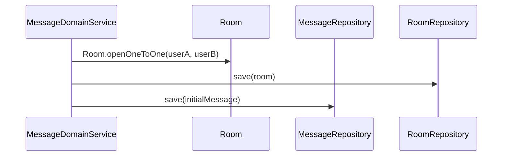
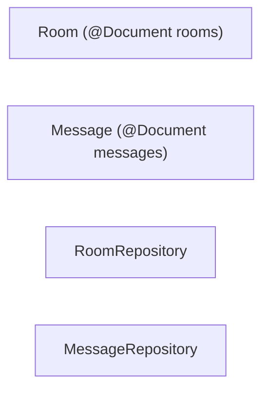

# [MESSAGE-01] Room·Message 도메인 (MySQL + JPA 단일 모델)

## 작업 내용 (설계 의도)

### 변경 사항

> **DB 결정 변경 (2026-05-20)**: 당초 MongoDB 였으나 Room 은 고정 스키마(참여자·이름), Message 는 읽음/전달 상태 일관성이 핵심이라 **MySQL + JPA 로 통합**한다. Mongo 는 Facility 만 사용. `be-code-convention.md` 단일 모델 + `JpaAuditingBase` 상속.

`domain.message` 패키지에 `Room`, `Message`, `RoomRepository`, `MessageRepository` 를 **JPA `@Entity`(= 도메인 Entity, 단일 모델)** 로 정의한다.

`Room`: `id`(PK), `name`(nullable for 1:1), `lastMessageAt`, audit 6컬럼.
`RoomParticipant`: **@ManyToMany 금지 → 매핑 Entity 로 풀어쓰기**. `id`(PK), `roomId`, `userId`(User.id FK 컬럼), audit 6컬럼. `UNIQUE(room_id, user_id, deleted_at)`.
`Message`: `id`(PK), `roomId`(FK 컬럼), `senderId`, `content`(TEXT), `sentAt`(ZonedDateTime), audit 6컬럼.

> Room–Message–RoomParticipant 는 FK id 만 보유 (연관객체 금지). 참여자 목록은 `RoomParticipantRepository.findActiveByRoomId(roomId)` 명시 쿼리.

인덱스 (V*__create_rooms_messages.sql, DATETIME(6)/FK·ENUM 금지):
- rooms: `idx_rooms_last_message_at(last_message_at)`.
- room_participants: `idx_rp_user_id(user_id)`, `idx_rp_room_id(room_id)`, `UNIQUE(room_id, user_id, deleted_at)`.
- messages: `idx_messages_room_id_sent_at(room_id, sent_at)`.

`Room.lastMessageBumpedTo(sentAt)`, `RoomParticipant` 추가/soft-delete 는 `RoomDomainService` 가 매핑 Entity 로 처리.

## 다이어그램

### 처리 흐름

### 클래스 의존

## 테스트 케이스

### 단위 테스트 (Unit)
| ID | 대상 | 케이스 |
|---|---|---|
| U-01 | `Room.openOneToOne` | participantIds에 두 사용자 ID를 정렬된 상태로 저장한다 (멱등 키 용도) |
| U-02 | `Room.addParticipant` | 이미 포함된 사용자에 대해 `DuplicateParticipantException`을 던진다 |
| U-03 | `Room.removeParticipant` | 마지막 참가자 제거 시 `EmptyRoomException`을 던진다 |

### 레포지토리 테스트 (Repository / Persistence)
| ID | 대상 | 케이스 |
|---|---|---|
| R-01 | participantIds 멀티키 인덱스 | `findByParticipantId(userId)`가 인덱스를 사용함을 explain plan으로 확인한다 |
| R-02 | `lastMessageAt desc` 인덱스 | 사용자별 최근 활성 채팅방 50개 조회 P95가 30ms 이하다 |
| R-03 | 1:1 unique | 동일 (userA, userB) 1:1 룸 동시 생성 시 1개만 적재된다 |

### 시나리오 테스트 (Scenario / Integration)
| ID | 시나리오 | 케이스 |
|---|---|---|
| S-01 | 100메시지 페이지네이션 | 두 사용자가 100개 메시지 주고받은 뒤 `findByRoomId(pageSize=20)`가 sentAt desc로 동작한다 |
