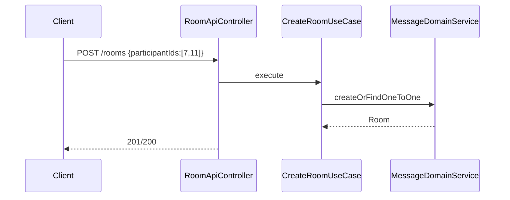
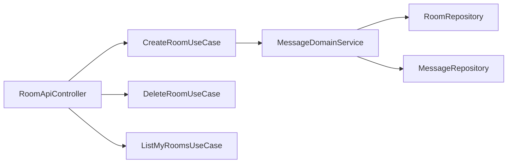

# [MESSAGE-02] 채팅방 생성·삭제·조회 API

## 작업 내용 (설계 의도)

### 변경 사항

`POST /rooms` 생성 (1:1 또는 그룹), `GET /rooms/{id}`, `GET /rooms/me` 본인 참여 룸 목록, `DELETE /rooms/{id}` 삭제.

`CreateRoomUseCase`는 participantIds 정렬 후 1:1이면 기존 룸 존재 확인 (있으면 그대로 반환).

`DeleteRoomUseCase`는 모든 참가자 합의가 아닌 단순 본인 탈퇴(`removeParticipant`)로 구현. 마지막 1인 탈퇴 시 Room + 연관 Message 일괄 삭제.

`GET /rooms/me?keyword=...`로 룸 이름·참가자 닉네임 검색.

## 다이어그램

### 처리 흐름

### 클래스 의존

## 테스트 케이스

### 단위 테스트 (Unit)
| ID | 대상 | 케이스 |
|---|---|---|
| U-01 | `CreateRoomUseCase` | 동일 1:1 룸이 이미 있으면 기존 룸을 반환하고 새로 만들지 않는다 |
| U-02 | `DeleteRoomUseCase` | 본인이 참가자가 아닌 룸 호출 시 `NotRoomParticipantException`을 던진다 |
| U-03 | `MessageDomainService` | 마지막 참가자 탈퇴 시 Room + 연관 Message가 함께 삭제된다 |

### 레포지토리 테스트 (Repository / Persistence)
| ID | 대상 | 케이스 |
|---|---|---|
| R-01 | `findMineByKeyword` | room.name 또는 participant nickname 매칭 결과가 반환된다 |
| R-02 | Cascade 삭제 | Room 삭제 시 연관 Message 1000건이 일괄 삭제된다 |

### 시나리오 테스트 (Scenario / Integration)
| ID | 시나리오 | 케이스 |
|---|---|---|
| S-01 | 1:1 멱등 생성 | 동일 두 사용자 1:1 룸 두 번 생성 요청은 항상 같은 roomId를 반환한다 |
| S-02 | 부분 탈퇴 | 사용자 A 탈퇴 후 B에게는 룸이 여전히 보인다 |
| S-03 | 전체 탈퇴 | 마지막 참가자 탈퇴 후 `GET /rooms/{id}`는 404 응답을 반환한다 |
