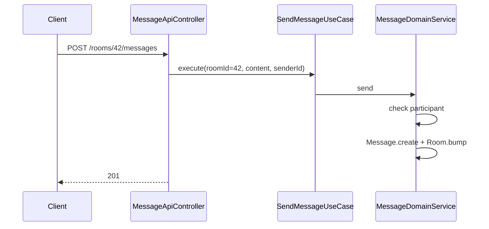
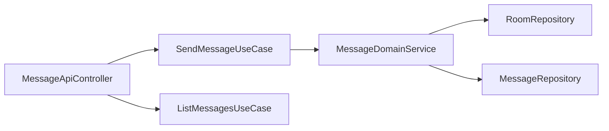

# [MESSAGE-03] 메시지 작성 + 채팅방 목록·키워드 검색 API

## 작업 내용 (설계 의도)

### 변경 사항

`POST /rooms/{roomId}/messages` 메시지 작성, `GET /rooms/{roomId}/messages?cursor=...` 커서 페이지네이션 조회.

`SendMessageUseCase` 흐름:
1. Room 존재 + 본인이 참가자인지 검증.
2. `Message.create`, save.
3. `Room.lastMessageBumpedTo(sentAt)` 호출 + save.

커서 기반 페이지네이션: `sentAt` 기준 `before` 커서. 한 페이지 30건.

실시간 전송(WebSocket/SSE)은 본 티켓 범위 밖 (V2). HTTP POST + 클라이언트 폴링 또는 push 알림은 NOTIFICATION 도메인으로 위임.

## 다이어그램

### 처리 흐름

### 클래스 의존

## 테스트 케이스

### 단위 테스트 (Unit)
| ID | 대상 | 케이스 |
|---|---|---|
| U-01 | `SendMessageUseCase` | 본인 참가자 아닌 룸 작성 시도 시 `NotRoomParticipantException`을 던진다 |
| U-02 | `Room.lastMessageBumpedTo` | 새 메시지 sentAt으로 갱신된다 |
| U-03 | `Message.create` | 빈 content에 대해 `EmptyMessageException`을 던진다 |

### 레포지토리 테스트 (Repository / Persistence)
| ID | 대상 | 케이스 |
|---|---|---|
| R-01 | `(roomId, sentAt desc)` 인덱스 | 커서 페이지네이션 쿼리에서 사용됨을 explain plan으로 확인한다 |
| R-02 | 대량 메시지 성능 | 1만건 메시지 적재 후 커서 페이지(30건) 조회 P95가 30ms 이하다 |

### 시나리오 테스트 (Scenario / Integration)
| ID | 시나리오 | 케이스 |
|---|---|---|
| S-01 | 작성 → 조회 | 메시지 작성 후 `GET /rooms/{id}/messages` 첫 페이지에 즉시 노출된다 |
| S-02 | 룸 정렬 갱신 | lastMessageAt 변경으로 `GET /rooms/me`에서 해당 룸이 최상단으로 정렬된다 |
| S-03 | 인가 위반 | 참가자가 아닌 사용자가 메시지 작성 시도 시 403 응답이 반환된다 |
