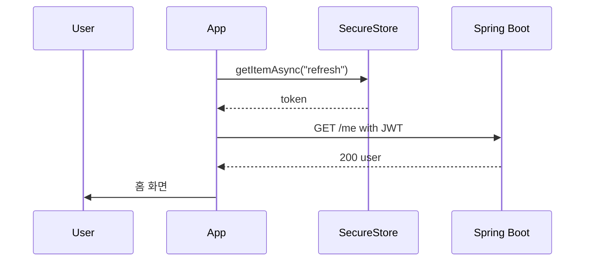

# [MOBILE-01] RN 0.74 + Expo 51 부트스트랩

## 작업 내용 (설계 의도)

### 변경 사항

`sports-application-mobile` 신규 레포에 React Native 0.74 + Expo SDK 51 골격을 구성한다. TypeScript strict, ESLint(@react-native), Prettier, Jest, Detox 설정. New Architecture(Fabric/TurboModules) 활성화.

expo-router 파일 기반 라우팅 적용. 디렉토리:
- `app/(tabs)/index.tsx` 홈
- `app/(tabs)/search.tsx` 시설 검색
- `app/(tabs)/me.tsx` 마이페이지
- `app/(auth)/login.tsx`, `register.tsx`
- `app/event/[id].tsx`, `app/product/[id].tsx` 등

`api/be-client.ts` axios 인스턴스 단일 빈. 토큰은 expo-secure-store에서 읽어 Authorization 헤더 자동 부착. 401 응답 시 refresh 토큰 회전 → 실패 시 로그인 화면 라우팅.

ENV: `EXPO_PUBLIC_API_URL` (퍼블릭), `EXPO_PUBLIC_APP_VARIANT`.

## 다이어그램

### 처리 흐름

### 클래스 의존

## 테스트 케이스

### 단위 테스트 (Unit)
| ID | 대상 | 케이스 |
|---|---|---|
| U-01 | `BeClient` 인터셉터 | 401 응답 시 refresh 호출 후 원 요청을 재시도한다 |
| U-02 | `BeClient` 인터셉터 | refresh 실패 시 SecureStore 토큰을 삭제하고 `/auth/login` 라우트로 이동한다 |
| U-03 | `EXPO_PUBLIC_API_URL` | 미설정 시 부팅 단계에서 에러를 던진다 |

### 레포지토리 테스트 (Repository / Persistence)
| ID | 대상 | 케이스 |
|---|---|---|
| R-01 | `lib/auth.ts` | accessToken은 메모리(Zustand)에, refreshToken은 SecureStore에 저장된다 |
| R-02 | AsyncStorage 검증 | AsyncStorage에 토큰이 절대 기록되지 않음을 grep + 런타임 가드로 확인한다 |

### 시나리오 테스트 (Scenario / Integration)
| ID | 시나리오 | 케이스 |
|---|---|---|
| S-01 | 앱 시작 (Detox) | SecureStore에 토큰 있으면 홈 탭, 없으면 로그인 화면으로 시작한다 |
