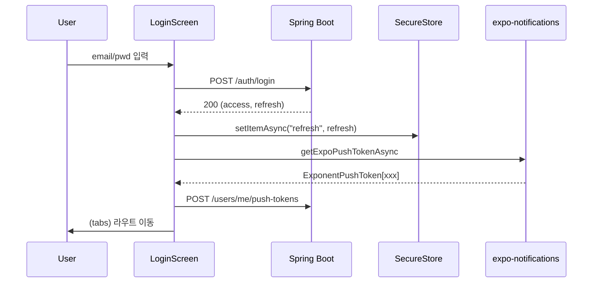
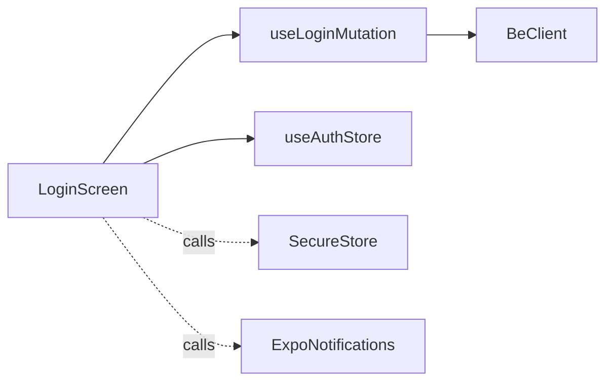

# [MOBILE-02] 가입·로그인 화면 + JWT SecureStore

## 작업 내용 (설계 의도)

### 변경 사항

`app/(auth)/login.tsx`, `app/(auth)/register.tsx` 화면. react-hook-form + zod 적용. Web 스키마와 동일 zod 객체를 sharable types 패키지로 추출 검토.

로그인 성공 시:
1. accessToken은 Zustand store에 저장 (메모리).
2. refreshToken은 expo-secure-store에 저장.
3. expo-notifications로 device push token 발급 → BE에 등록 (`POST /users/me/push-tokens`).

로그아웃 시 SecureStore + 메모리 토큰 모두 삭제 + push token 등록 해제.

Biometric 인증(FaceID/TouchID) 활성화는 V2.

## 다이어그램

### 처리 흐름

### 클래스 의존

## 테스트 케이스

### 단위 테스트 (Unit)
| ID | 대상 | 케이스 |
|---|---|---|
| U-01 | `useLoginMutation` | 잘못된 비밀번호 응답 시 한국어 메시지로 변환된다 |
| U-02 | `useAuthStore` | logout 액션 호출 시 메모리/SecureStore 모두 비워진다 |
| U-03 | `RegisterSchema` | 이메일/비밀번호 정규식이 잘못된 입력을 거부한다 |

### 레포지토리 테스트 (Repository / Persistence)
| ID | 대상 | 케이스 |
|---|---|---|
| R-01 | SecureStore | 로그아웃 후 refresh 키가 존재하지 않는다 (`getItemAsync`가 null 반환) |

### 시나리오 테스트 (Scenario / Integration)
| ID | 시나리오 | 케이스 |
|---|---|---|
| S-01 | 정상 로그인 (Detox) | 폼 입력 → 제출 → 홈 탭 진입 + 사용자 닉네임 표시 |
| S-02 | 푸시 토큰 등록 | 로그인 직후 BE의 `POST /users/me/push-tokens` 호출이 발생한다 (mock) |
| S-03 | 권한 거부 fallback | 알림 권한 거부 시 푸시 토큰 등록은 skip되고 앱은 정상 동작한다 |
