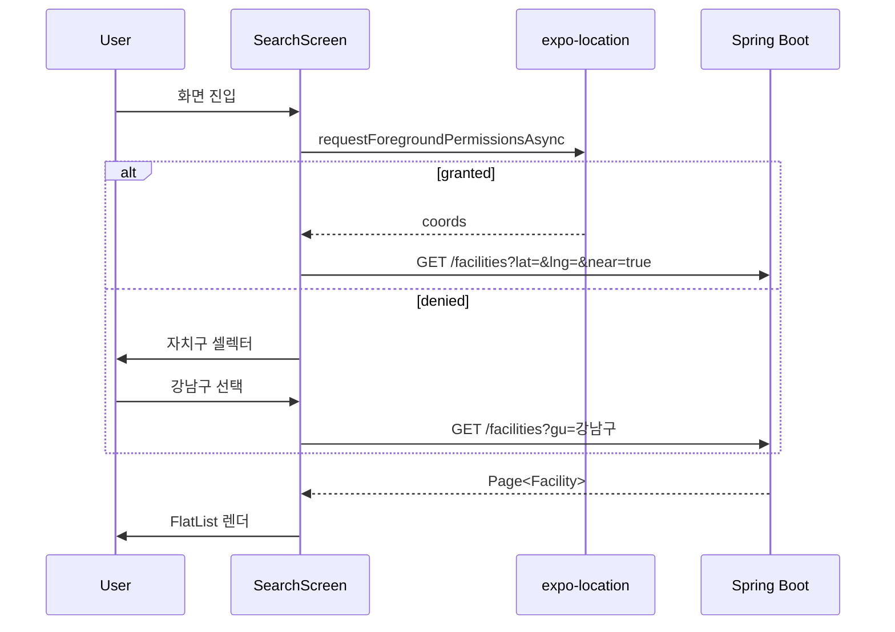
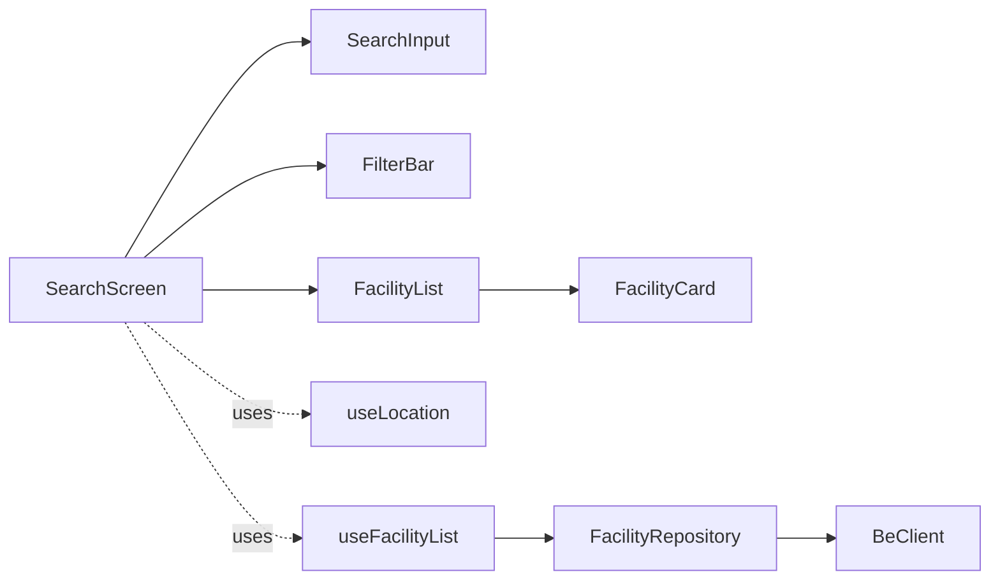

# [MOBILE-03] 시설 검색 + 위치 기반 추천 화면

## 작업 내용 (설계 의도)

### 변경 사항

`app/(tabs)/search.tsx`. 상단에 검색 input + gu/type 필터. 하단에 FlatList로 결과.

`expo-location`으로 사용자 좌표 획득(권한 요청) → BE에 `near` 좌표 전달 → 거리순 정렬 결과. 권한 거부 시 자치구 셀렉터 fallback.

지도 미리보기는 시설 단건 화면(MOBILE-04)에서. 검색 화면은 카드 리스트만.

캐시 정책: TanStack Query staleTime 60초, gcTime 5분.

## 다이어그램

### 처리 흐름

### 클래스 의존

## 테스트 케이스

### 단위 테스트 (Unit)
| ID | 대상 | 케이스 |
|---|---|---|
| U-01 | `useLocation` | 권한 거부 상태를 boolean으로 정확히 반환한다 |
| U-02 | `FacilityCard` | 거리(distance)가 응답에 있을 때만 표시되고 없으면 숨겨진다 |
| U-03 | `useFacilityList` | 동일 검색 조건은 60초 내 캐시 hit으로 네트워크 호출이 발생하지 않는다 |

### 레포지토리 테스트 (Repository / Persistence)
| ID | 대상 | 케이스 |
|---|---|---|
| R-01 | `FacilityRepository` | axios 응답 인터셉터가 401 발생 시 refresh 흐름을 트리거한다 |

### 시나리오 테스트 (Scenario / Integration)
| ID | 시나리오 | 케이스 |
|---|---|---|
| S-01 | 위치 기반 검색 (Detox) | 위치 권한 허용 → 거리순 결과 카드 5건이 렌더된다 |
| S-02 | 권한 거부 fallback | 위치 권한 거부 시 자치구 셀렉터가 표시되고 선택 후 결과가 갱신된다 |
| S-03 | 무한 스크롤 | FlatList 끝 도달 시 다음 페이지가 fetch되어 추가 카드가 렌더된다 |
