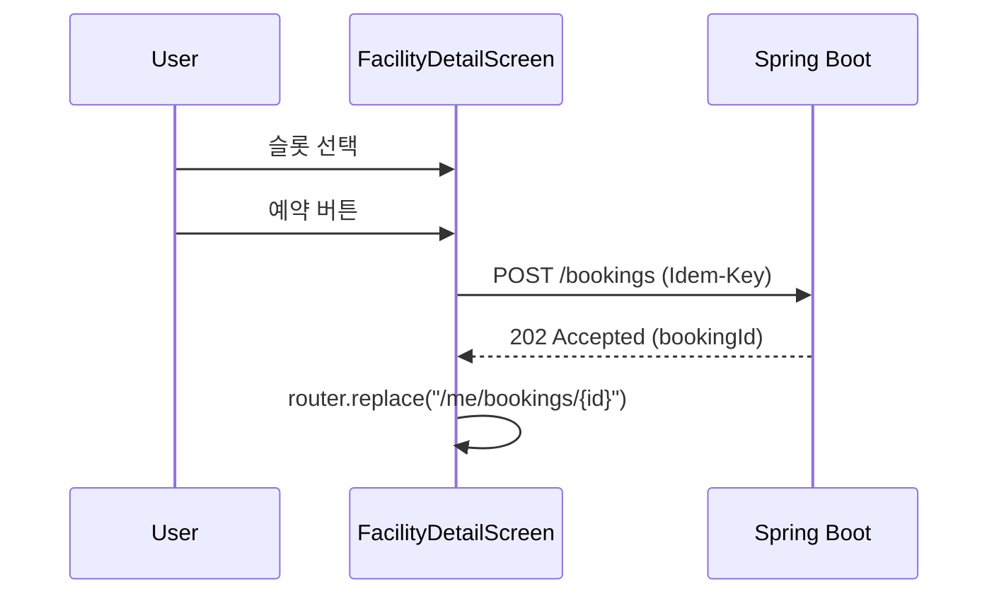
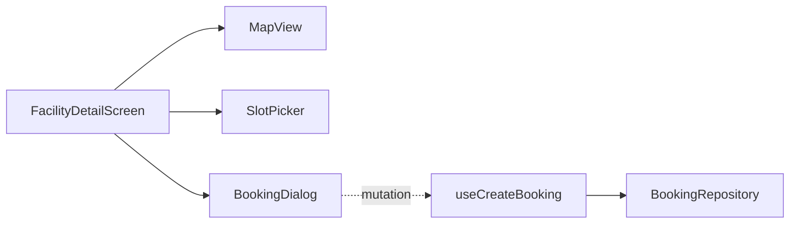

# [MOBILE-04] 시설 단건 + 지도 + 예약 흐름

## 작업 내용 (설계 의도)

### 변경 사항

`app/facility/[id].tsx` 단건 화면. 상단에 지도(`react-native-maps`, MapKit/GoogleMaps), 본문에 시설 정보, 하단에 슬롯 선택 → "예약" 버튼.

`react-native-maps`의 Marker로 시설 위치 표시. 사용자 위치도 함께 표시 가능 시 거리 라벨.

예약 흐름:
1. 슬롯 선택 → 모달로 결제 정보 입력.
2. `POST /bookings` 호출 (Idempotency-Key UUID).
3. 202 응답 즉시 마이페이지 예약 상태 화면으로 라우팅.

## 다이어그램

### 처리 흐름

### 클래스 의존

## 테스트 케이스

### 단위 테스트 (Unit)
| ID | 대상 | 케이스 |
|---|---|---|
| U-01 | `SlotPicker` | capacity=0 슬롯은 disabled 상태로 렌더된다 |
| U-02 | `useCreateBooking` | Idempotency-Key가 매 호출마다 새 UUID로 생성된다 |
| U-03 | `MapView` | 시설 좌표가 props로 전달되면 단 1개 Marker만 렌더된다 |

### 레포지토리 테스트 (Repository / Persistence)
| ID | 대상 | 케이스 |
|---|---|---|
| R-01 | `BookingRepository.create` | 응답이 202면 bookingId가 정확히 반환된다 |

### 시나리오 테스트 (Scenario / Integration)
| ID | 시나리오 | 케이스 |
|---|---|---|
| S-01 | 예약 흐름 (Detox) | 슬롯 선택 → 예약 → 마이페이지 예약 상태 화면 진입 + PENDING 표시 |
| S-02 | 충돌 응답 | BE 409 응답 시 토스트로 슬롯 충돌 메시지가 표시된다 |
| S-03 | 지도 렌더 | iOS/Android 모두에서 MapView가 정상 렌더되어 시설 좌표 marker가 표시된다 |
