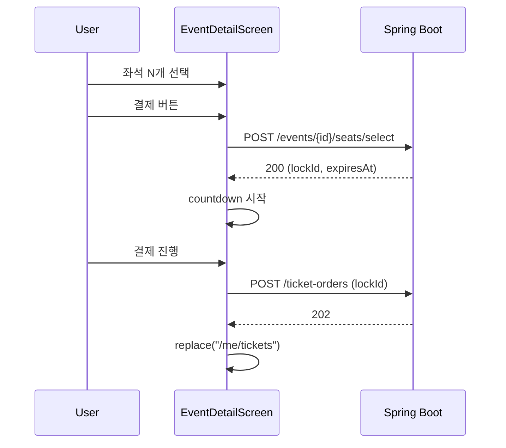
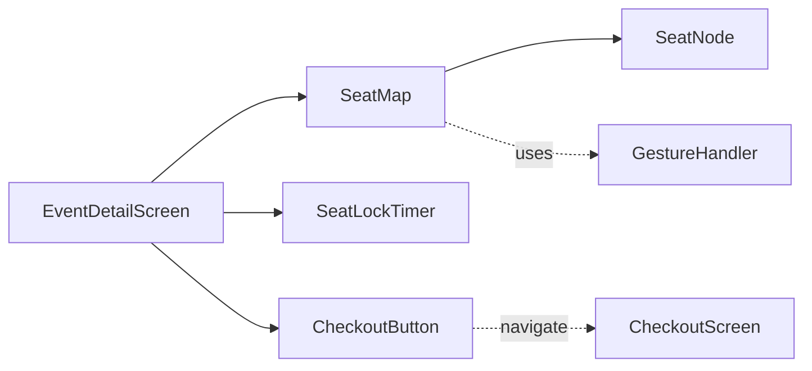

# [MOBILE-05] 경기 단건 + 좌석맵 + 티켓 구매 화면

## 작업 내용 (설계 의도)

### 변경 사항

`app/event/[id].tsx`. 상단에 경기 정보, 본문에 좌석맵, 하단에 선택 좌석 + "결제" 버튼.

좌석맵은 SVG가 아닌 RN 친화적인 react-native-svg로 구현. pan/zoom은 react-native-gesture-handler + react-native-reanimated.

좌석 선택 → BE `POST /events/{id}/seats/select` → lockId 응답 + 5분 카운트다운. 카운트다운은 react-native-reanimated worklet으로 60fps 유지.

결제 화면은 별도 `app/checkout/[orderType]/[orderId].tsx` (공용). BE 호출 후 202 → 발권 상태 화면.

## 다이어그램

### 처리 흐름

### 클래스 의존

## 테스트 케이스

### 단위 테스트 (Unit)
| ID | 대상 | 케이스 |
|---|---|---|
| U-01 | `SeatMap` | 이미 발권된 좌석을 클릭해도 onSelect가 호출되지 않는다 |
| U-02 | `SeatLockTimer` | 카운트다운이 1초 단위로 갱신되고 0 도달 시 onExpire 콜백을 호출한다 |
| U-03 | `useSelectSeats` | BE 409 응답 시 선택 상태가 초기화된다 |

### 레포지토리 테스트 (Repository / Persistence)
| ID | 대상 | 케이스 |
|---|---|---|
| R-01 | `TicketingRepository.selectSeats` | lockId/expiresAt이 정확히 파싱되어 store에 저장된다 |

### 시나리오 테스트 (Scenario / Integration)
| ID | 시나리오 | 케이스 |
|---|---|---|
| S-01 | 좌석 선택 흐름 (Detox) | 좌석 선택 → 결제 → 발권 대기 → 5초 내 발권 완료 화면 (BE mock) |
| S-02 | 락 만료 | 5분 경과 후 결제 시도 시 409 응답이 토스트로 노출되고 좌석 선택이 초기화된다 |
| S-03 | 좌석맵 제스처 | pan/zoom 제스처가 60fps로 동작한다 (성능 메트릭 기록) |
