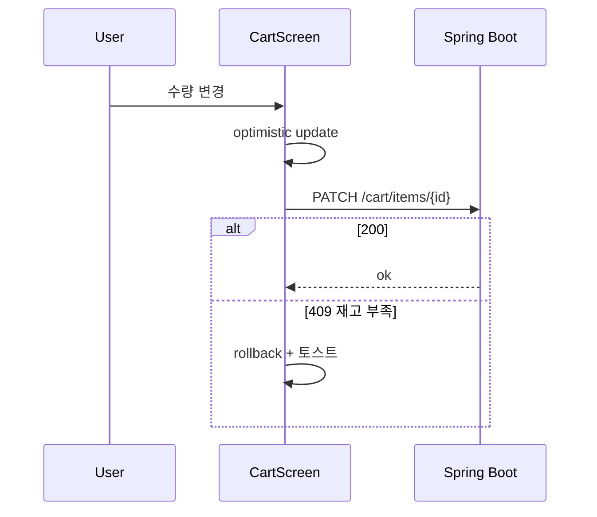
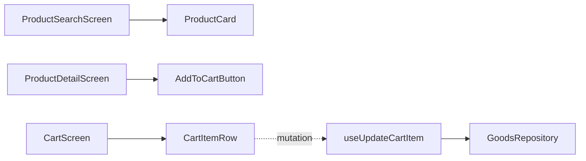

# [MOBILE-06] 상품 검색·장바구니·주문 화면

## 작업 내용 (설계 의도)

### 변경 사항

`app/product/index.tsx` 검색 + 인기 상품 캐러셀. `app/product/[id].tsx` 단건. `app/(tabs)/cart.tsx` 장바구니.

장바구니는 RN 자체 ScrollView + 옵티미스틱 업데이트. quantity 변경은 + / − 버튼.

주문 진행은 `app/checkout/goods/[orderId].tsx` 경유. 카드 결제 정보는 Web과 달리 PG mock SDK를 사용 (실 PG 어댑터는 BE에서 처리).

## 다이어그램

### 처리 흐름

### 클래스 의존

## 테스트 케이스

### 단위 테스트 (Unit)
| ID | 대상 | 케이스 |
|---|---|---|
| U-01 | `CartItemRow` | quantity > stockQuantity면 + 버튼이 disabled된다 |
| U-02 | `useUpdateCartItem` | optimistic rollback 시 이전 quantity로 복원된다 |
| U-03 | `useCreateGoodsOrder` | 빈 장바구니 상태에서 mutation을 호출하지 않고 가드된다 |

### 레포지토리 테스트 (Repository / Persistence)
| ID | 대상 | 케이스 |
|---|---|---|
| R-01 | `GoodsRepository.createOrder` | 응답 202의 orderId를 정확히 반환한다 |

### 시나리오 테스트 (Scenario / Integration)
| ID | 시나리오 | 케이스 |
|---|---|---|
| S-01 | 장바구니 → 주문 (Detox) | 상품 담기 → 수량 변경 → 주문 진행 → 발송 대기 화면 진입 |
| S-02 | 재고 충돌 rollback | BE 409 응답 시 UI quantity가 즉시 이전 값으로 되돌아간다 |
| S-03 | 인기 상품 캐러셀 | 인기 상품 5건이 가로 스크롤 캐러셀로 표시된다 |
