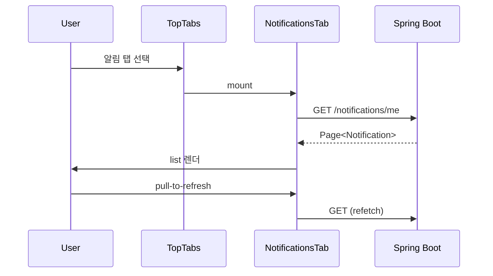
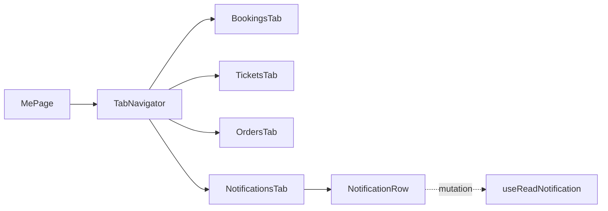

# [MOBILE-07] 마이페이지 탭 (예약/티켓/주문/알림)

## 작업 내용 (설계 의도)

### 변경 사항

`app/(tabs)/me.tsx` 메인 + `app/me/bookings.tsx`, `tickets.tsx`, `orders.tsx`, `notifications.tsx` 하위. 상단 탭 네비게이션 `@react-navigation/material-top-tabs`.

각 탭은 본인 자원만 표시. Pull-to-refresh 지원. 무한 스크롤로 페이지 로딩.

미읽음 알림 뱃지는 탭 바 아이콘에 표시. `useUnreadCount` hook이 60초 폴링 + 푸시 알림 수신 시 즉시 갱신.

## 다이어그램

### 처리 흐름

### 클래스 의존

## 테스트 케이스

### 단위 테스트 (Unit)
| ID | 대상 | 케이스 |
|---|---|---|
| U-01 | `useUnreadCount` | 푸시 수신 이벤트 발생 시 즉시 refetch가 트리거된다 |
| U-02 | `NotificationRow` | read 액션 호출 시 옵티미스틱으로 읽음 상태로 변경된다 |
| U-03 | `BookingsTab` | 무한 스크롤 끝 도달 시 다음 페이지가 fetch된다 |

### 레포지토리 테스트 (Repository / Persistence)
| ID | 대상 | 케이스 |
|---|---|---|
| R-01 | TanStack Query persist | 마지막 응답이 디스크에 캐시되어 앱 재진입 시 즉시 표시된다 |

### 시나리오 테스트 (Scenario / Integration)
| ID | 시나리오 | 케이스 |
|---|---|---|
| S-01 | 탭 전환 (Detox) | 4개 탭 전환이 부드럽고 각 탭이 본인 자원만 표시한다 |
| S-02 | Pull-to-refresh | 위로 당기면 refetch가 발생하고 최신 데이터로 갱신된다 |
| S-03 | 뱃지 갱신 | 알림 1건 read 후 탭 바 뱃지가 -1로 갱신된다 |
