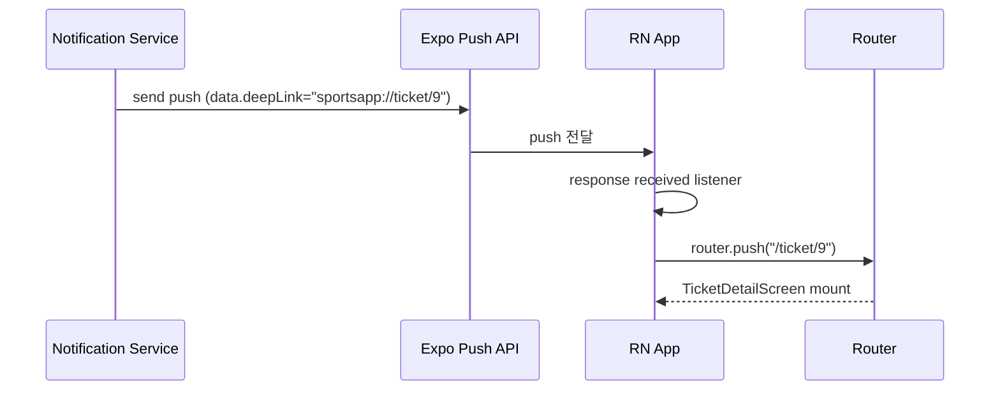
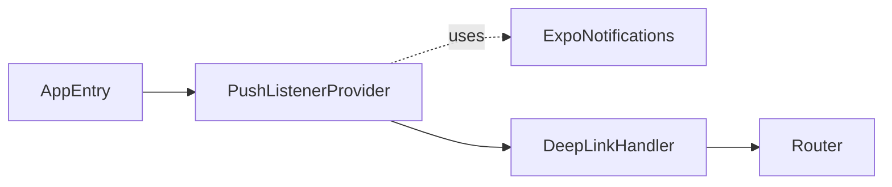

# [MOBILE-08] Expo 푸시 알림 + 딥링크 라우팅

## 작업 내용 (설계 의도)

### 변경 사항

Expo Notifications 셋업:
- 로그인 직후 `getExpoPushTokenAsync`로 토큰 발급.
- BE `POST /users/me/push-tokens`에 토큰 + 플랫폼 + 디바이스 ID 전송.
- 로그아웃 시 BE `DELETE /users/me/push-tokens/{tokenId}` 호출.

푸시 알림 수신:
- 포그라운드: `Notifications.addNotificationReceivedListener`로 토스트 표시.
- 백그라운드/종료: 알림 탭 시 `Notifications.addNotificationResponseReceivedListener`에서 `notification.request.content.data.deepLink` 추출 → expo-router의 `router.push(url)`.

딥링크 스킴: `sportsapp://event/{id}`, `sportsapp://ticket/{id}`, `sportsapp://booking/{id}`, `sportsapp://notification/{id}`.

## 다이어그램

### 처리 흐름

### 클래스 의존

## 테스트 케이스

### 단위 테스트 (Unit)
| ID | 대상 | 케이스 |
|---|---|---|
| U-01 | `DeepLinkHandler.parse` | `sportsapp://ticket/9` → `{ route: "/ticket/9" }`로 파싱된다 |
| U-02 | `DeepLinkHandler.parse` | 미지원 호스트 입력 시 fallback으로 홈 라우트가 반환된다 |
| U-03 | `usePushToken` | 토큰 발급 실패 시 콘솔 경고 로그를 남기고 앱은 정상 동작한다 |

### 레포지토리 테스트 (Repository / Persistence)
| ID | 대상 | 케이스 |
|---|---|---|
| R-01 | `PushTokenRepository.register` | 로그인 후 BE의 push-tokens 등록 API가 호출된다 |
| R-02 | `PushTokenRepository.unregister` | 로그아웃 시 BE의 push-tokens 해제 API가 호출된다 |

### 시나리오 테스트 (Scenario / Integration)
| ID | 시나리오 | 케이스 |
|---|---|---|
| S-01 | 푸시 → 딥링크 (Detox + Expo mock) | 푸시 알림 응답 시 TicketDetailScreen이 mount된다 |
| S-02 | 포그라운드 알림 | 앱 사용 중 푸시 수신 시 토스트로 표시되고 자동으로 dismiss된다 |
| S-03 | 권한 거부 | 알림 권한 없는 디바이스에서도 앱이 크래시 없이 정상 동작한다 |
