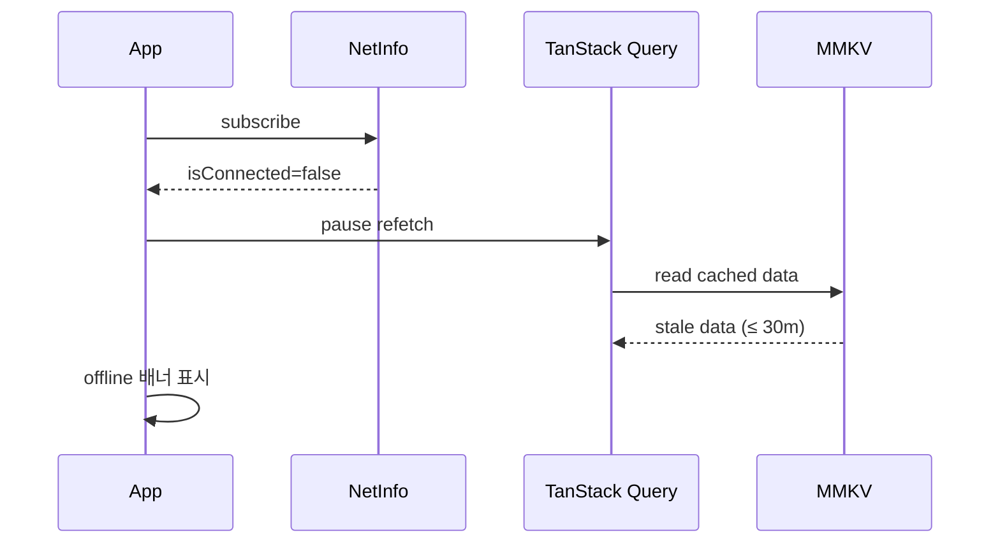
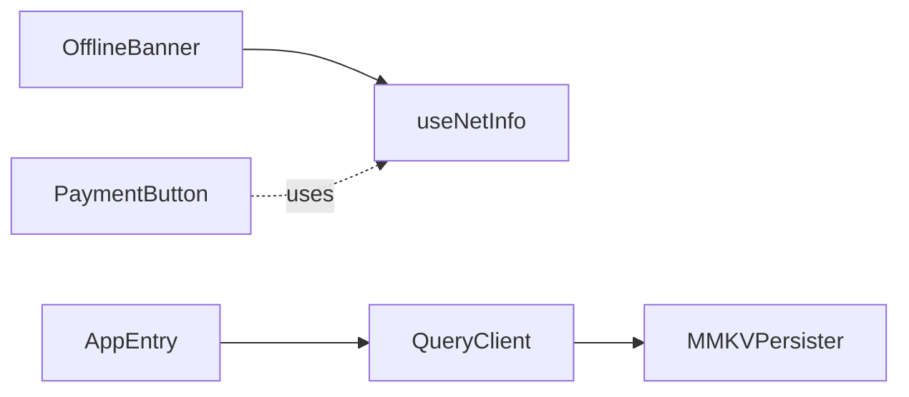

# [MOBILE-09] 오프라인 처리 + 성능 메트릭

## 작업 내용 (설계 의도)

### 변경 사항

오프라인 처리:
- TanStack Query persist를 mmkv 기반 storage로 설정. 조회 응답은 디스크에 30분 저장.
- 결제·예약·티켓 구매는 오프라인 시 명시적으로 차단하고 "네트워크 연결 필요" UI 표시.
- `@react-native-community/netinfo`로 네트워크 상태 구독.

성능 메트릭:
- 앱 시작 → 홈 탭 렌더 TTI(Time To Interactive) P95 ≤ 2초 (mid-range Android 기준).
- FlatList 스크롤 60fps 유지.
- React Native Performance Monitor 결과를 CI에서 수집.

이미지 최적화:
- `expo-image`로 cache + memory/disk 두 단계.
- 시설/상품 이미지 thumbnail/original 두 단계 응답을 BE가 제공.

## 다이어그램

### 처리 흐름

### 클래스 의존

## 테스트 케이스

### 단위 테스트 (Unit)
| ID | 대상 | 케이스 |
|---|---|---|
| U-01 | `OfflineBanner` | NetInfo.isConnected=false 시 배너가 표시된다 |
| U-02 | `PaymentButton` | 오프라인 상태에서 onPress가 호출되지 않고 토스트만 표시된다 |
| U-03 | `MMKVPersister` | TanStack Query cache가 mmkv에 직렬화되어 저장된다 |

### 레포지토리 테스트 (Repository / Persistence)
| ID | 대상 | 케이스 |
|---|---|---|
| R-01 | mmkv | 30분 경과한 캐시는 자동으로 stale 표시되어 다음 요청 시 refetch된다 |

### 시나리오 테스트 (Scenario / Integration)
| ID | 시나리오 | 케이스 |
|---|---|---|
| S-01 | 오프라인 진입 (Detox + 네트워크 차단) | 시설 목록 화면이 마지막 캐시 응답으로 즉시 표시된다 |
| S-02 | 오프라인 결제 차단 | 결제 버튼 탭 시 토스트 + 차단되어 BE 호출이 발생하지 않는다 |
| S-03 | TTI 성능 | 콜드 스타트 → 홈 탭 렌더 TTI가 P95 2초 이하다 |
