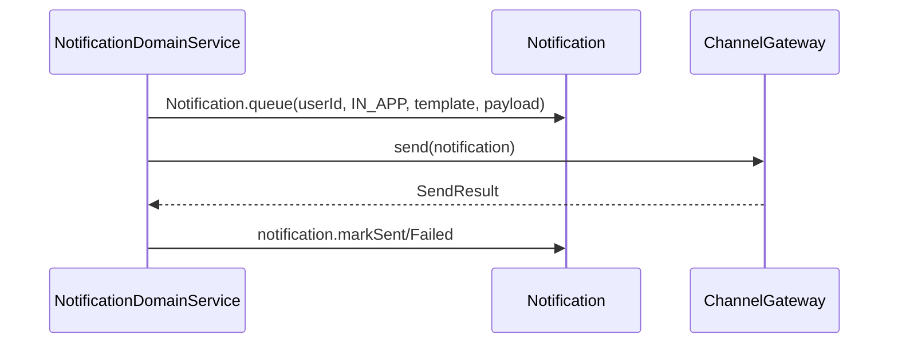
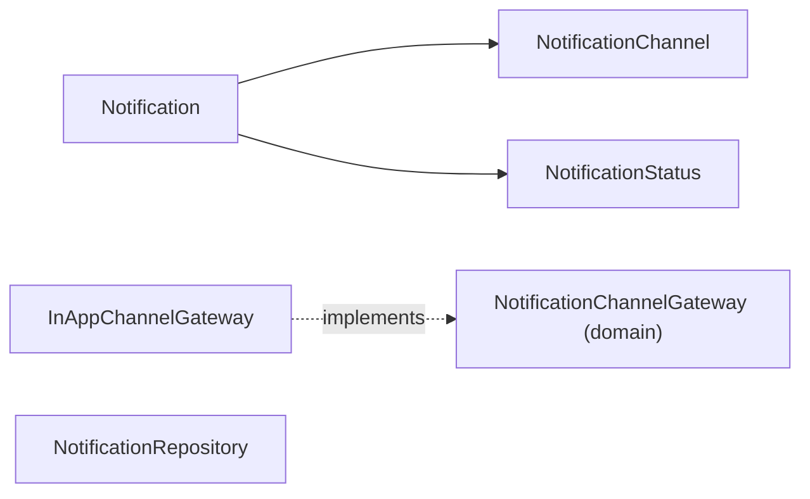

# [NOTIFICATION-01] Notification Entity + Channel Gateway 추상

## 작업 내용 (설계 의도)

### 변경 사항

`domain.notification` 패키지에 `Notification`, `NotificationChannel` enum(IN_APP/PUSH/EMAIL/SMS), `NotificationStatus` enum(QUEUED/SENT/FAILED), `NotificationRepository`를 정의한다.

V1 구현 채널: **IN_APP**(NOTIFICATION-02) + **PUSH**(NOTIFICATION-06). EMAIL/SMS는 V2.

`Notification`: `id`, `userId`, `channel`, `templateId`, `payload`(JSON 컬럼), `status`, `sentAt`, `createdAt`.

`NotificationChannelGateway` interface (도메인 패키지). 메서드: `send(notification): SendResult`.

infrastructure에 `InAppChannelGateway` 구현 (DB 적재만). EMAIL/SMS/PUSH는 V2.

JSON 컬럼은 `@Type(JsonStringType::class)` + data class. `ObjectMapper` 직접 사용 금지 (be-code-convention).

Flyway `V10__notification.sql` 테이블.

## 다이어그램

### 처리 흐름

### 클래스 의존

## 테스트 케이스

### 단위 테스트 (Unit)
| ID | 대상 | 케이스 |
|---|---|---|
| U-01 | `Notification.markSent` | QUEUED 상태에서만 호출 가능, 다른 상태는 `InvalidNotificationStateException` |
| U-02 | `Notification.queue` | payload가 null이면 빈 객체로 초기화된다 |

### 레포지토리 테스트 (Repository / Persistence)
| ID | 대상 | 케이스 |
|---|---|---|
| R-01 | JSON 컬럼 payload | 중첩 객체 저장 후 동일 구조로 역직렬화된다 |
| R-02 | `findByUserIdAndStatus` | (userId, QUEUED) 조회가 정확한 결과를 반환한다 |
| R-03 | 동시성 | 같은 notification의 markSent를 동시 호출 시 한 번만 성공한다 |

### 시나리오 테스트 (Scenario / Integration)
| ID | 시나리오 | 케이스 |
|---|---|---|
| S-01 | 인앱 발송 | InAppChannelGateway 호출 시 DB에 status=SENT, sentAt 채워진 row가 저장된다 |
| S-02 | 미지원 채널 | 미구현 EMAIL 채널 요청 시 `UnsupportedChannelException` + status=FAILED 저장 |
