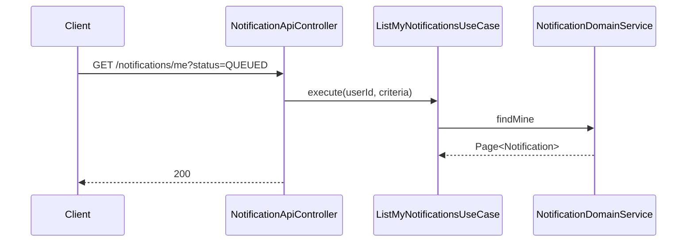
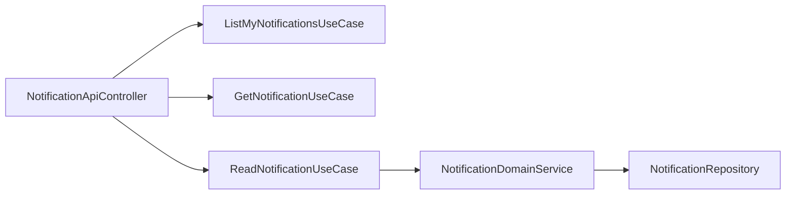

# [NOTIFICATION-02] 인앱 채널 구현 + 단건 조회 API

## 작업 내용 (설계 의도)

### 변경 사항

`InAppChannelGateway` 구현 + 사용자 알림 조회 API:
- `GET /notifications/me?status=QUEUED&page=0&size=20`
- `GET /notifications/{id}` 단건
- `PATCH /notifications/{id}/read` 읽음 처리 (별도 read_at 컬럼 추가)

`ReadNotificationUseCase`는 본인 알림만 처리. 다른 사용자 알림 PATCH 시도 시 403.

읽지 않은 알림 카운트 API `GET /notifications/me/unread-count`도 함께 제공.

Flyway에 `read_at TIMESTAMP NULL` 컬럼 추가.

## 다이어그램

### 처리 흐름

### 클래스 의존

## 테스트 케이스

### 단위 테스트 (Unit)
| ID | 대상 | 케이스 |
|---|---|---|
| U-01 | `ReadNotificationUseCase` | 본인 알림 아닌 ID 호출 시 `NotificationNotOwnedException`을 던진다 |
| U-02 | `ReadNotificationUseCase` | 이미 읽은 알림 재호출 시 read_at은 변경되지 않고 멱등 noop이다 |

### 레포지토리 테스트 (Repository / Persistence)
| ID | 대상 | 케이스 |
|---|---|---|
| R-01 | `countUnread` | `read_at IS NULL` 조건으로 정확한 카운트를 반환한다 |
| R-02 | `(userId, status, created_at desc)` 인덱스 | 페이지네이션 쿼리에서 사용됨을 explain plan으로 확인한다 |

### 시나리오 테스트 (Scenario / Integration)
| ID | 시나리오 | 케이스 |
|---|---|---|
| S-01 | unread 카운트 | 5건 적재 후 unread-count=5, 1건 read 후 4로 변경된다 |
| S-02 | 인가 | 다른 사용자 알림 단건 조회 시 403 응답이 반환된다 |
| S-03 | 정렬 | 페이지네이션 결과가 createdAt desc 순으로 정렬된다 |
