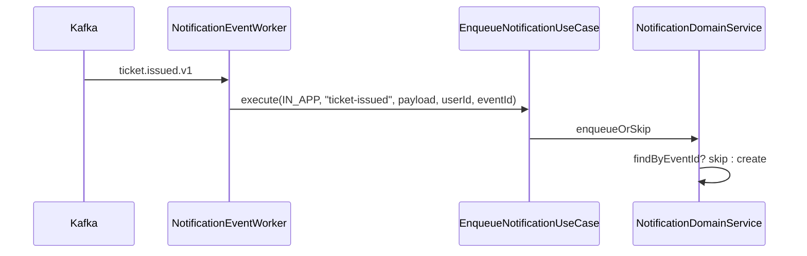
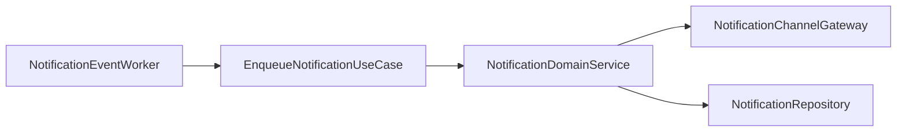

# [NOTIFICATION-03] payment.completed / booking.confirmed / ticket.issued consumer

## 작업 내용 (설계 의도)

### 변경 사항

`presentation/consumer/NotificationEventWorker`에서 4개 토픽 구독:
- `payment.completed.v1` → 결제 완료 알림 발송
- `booking.confirmed.v1` → 예약 확정 알림
- `ticket.issued.v1` → 발권 완료 알림 (티켓별 1건 또는 묶음 1건)
- `goods.stock.changed.v1` → V2 예약 (관심 상품 재입고 알림)

각 토픽별로 `EnqueueNotificationUseCase.execute(channel=IN_APP, templateId, payload, recipientUserId)` 호출. templateId 매핑은 `application.yml`에 표로.

멱등성: 같은 이벤트 키(`paymentId`, `bookingId`, `ticketId`)로 이미 적재된 알림이 있으면 skip. 컬럼 `event_id` + unique index.

## 다이어그램

### 처리 흐름

### 클래스 의존

## 테스트 케이스

### 단위 테스트 (Unit)
| ID | 대상 | 케이스 |
|---|---|---|
| U-01 | `EnqueueNotificationUseCase` | 미지원 channel 입력 시 `UnsupportedChannelException`을 던진다 |
| U-02 | `EnqueueNotificationUseCase` | 동일 eventId로 재호출 시 skip 로직을 타고 INSERT가 실행되지 않는다 (Mock Repository) |

### 레포지토리 테스트 (Repository / Persistence)
| ID | 대상 | 케이스 |
|---|---|---|
| R-01 | `event_id` unique index | 위반 시 `DuplicateNotificationException`이 발생한다 |
| R-02 | Consumer 동시 처리 | 두 인스턴스가 같은 이벤트 처리해도 알림이 1건만 적재된다 |

### 시나리오 테스트 (Scenario / Integration)
| ID | 시나리오 | 케이스 |
|---|---|---|
| S-01 | payment.completed → 발송 | 페이로드 발행 후 5초 내 알림 row 1건이 status=SENT 상태로 적재된다 |
| S-02 | 멱등성 | 동일 이벤트 재발행 시 알림 row가 증가하지 않는다 |
| S-03 | 묶음 알림 | `ticket.issued.v1`의 ticketIds[] 다건도 사용자별 단일 묶음 알림으로 처리된다 |
