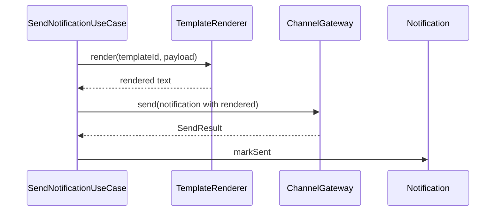
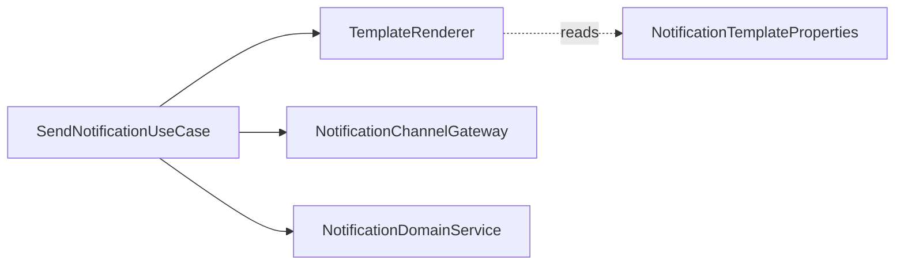

# [NOTIFICATION-04] 알림 템플릿 렌더링 + 발송 UseCase

## 작업 내용 (설계 의도)

### 변경 사항

`NotificationTemplate`은 `application.yml` 또는 별도 `notification-templates.yml`에 키-템플릿 매핑으로 보관. 본 단계에서는 DB로 빼지 않고 정적 설정만.

예시:
```yaml
notification:
  templates:
    payment-completed:
      title: "결제 완료"
      body: "{amount}원 결제가 완료되었습니다."
```

`TemplateRenderer`는 payload 키를 템플릿 placeholder에 치환. 누락된 키는 빈 문자열로 대체하되 로그 경고.

`SendNotificationUseCase`는 ChannelGateway 호출 + Notification.markSent. 본 티켓에서 NOTIFICATION-03의 Enqueue UseCase가 내부적으로 본 UseCase를 호출하도록 와이어업.

## 다이어그램

### 처리 흐름



### 클래스 의존



## 테스트 케이스

### 단위 테스트 (Unit)
| ID | 대상 | 케이스 |
|---|---|---|
| U-01 | `TemplateRenderer.render` | "payment-completed" + {amount:30000} 입력 시 정확한 렌더 결과를 반환한다 |
| U-02 | `TemplateRenderer` | 누락된 placeholder 키는 빈 문자열로 치환되고 경고 로그가 남는다 |
| U-03 | `TemplateRenderer` | 미존재 templateId 입력 시 `UnknownTemplateException`을 던진다 |

### 레포지토리 테스트 (Repository / Persistence)
| ID | 대상 | 케이스 |
|---|---|---|
| R-01 | 정상 발송 후 저장 | Notification row가 status=SENT, sentAt 채워진 상태로 저장된다 |
| R-02 | Gateway 실패 | ChannelGateway 예외 발생 시 status=FAILED + failureReason 저장 후 트랜잭션 정상 커밋 |

### 시나리오 테스트 (Scenario / Integration)
| ID | 시나리오 | 케이스 |
|---|---|---|
| S-01 | 이벤트 → 발송 전체 흐름 | `payment.completed.v1` 수신 후 5초 내 렌더링 → 발송 → DB 적재가 완료된다 |
| S-02 | 멱등 발송 | 동일 이벤트 재수신 시 ChannelGateway가 1회만 호출된다 |
