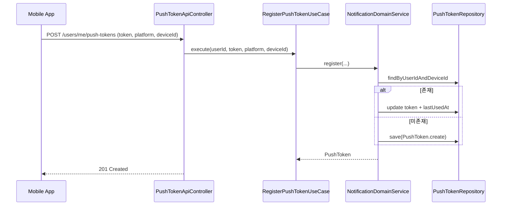
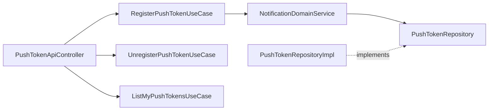

# [NOTIFICATION-05] 모바일 푸시 토큰 등록·해제 API

## 작업 내용 (설계 의도)

### 변경 사항

모바일 앱(MOBILE-08)이 Expo로부터 발급받은 push token을 BE에 등록·해제하는 API를 추가한다. Notification 도메인이 발송 시 사용자 ID로 push token을 조회해 Expo Push Service에 전달.

`domain.notification` 패키지에 `PushToken` Entity와 `PushTokenRepository` interface 추가.

`PushToken`: `id`, `userId`, `token`(Expo `ExponentPushToken[xxx]` 형식), `platform`(IOS/ANDROID), `deviceId`(unique per user), `createdAt`, `lastUsedAt`. unique `(userId, deviceId)`.

API:
- `POST /users/me/push-tokens` — 토큰 등록 (이미 같은 deviceId 있으면 token 갱신)
- `DELETE /users/me/push-tokens/{tokenId}` — 본인 토큰 해제
- `GET /users/me/push-tokens` — 본인 등록 토큰 목록 (디바이스 관리 화면용)

Flyway `V11__push_token.sql` 테이블.

토큰은 Expo 형식 정규식(`^ExponentPushToken\[[A-Za-z0-9_-]+\]$`)으로 검증. 잘못된 형식은 `InvalidPushTokenException` → 422.

## 다이어그램

### 처리 흐름

### 클래스 의존

## 테스트 케이스

### 단위 테스트 (Unit)
| ID | 대상 | 케이스 |
|---|---|---|
| U-01 | `PushToken.create` | Expo 정규식과 일치하지 않는 token은 `InvalidPushTokenException`을 던진다 |
| U-02 | `RegisterPushTokenUseCase` | 동일 (userId, deviceId) 존재 시 token만 갱신하고 새 row를 만들지 않는다 |
| U-03 | `UnregisterPushTokenUseCase` | 본인 소유 아닌 tokenId 호출 시 `NotPushTokenOwnerException`을 던진다 |

### 레포지토리 테스트 (Repository / Persistence)
| ID | 대상 | 케이스 |
|---|---|---|
| R-01 | `(user_id, device_id)` unique | 동일 (userId, deviceId)로 두 row 시도 시 unique 제약이 위반된다 |
| R-02 | `findByUserId` | 한 사용자가 보유한 모든 활성 토큰 N개를 반환한다 |
| R-03 | Cascade | User 삭제 시 push_token row가 cascade로 삭제된다 |

### 시나리오 테스트 (Scenario / Integration)
| ID | 시나리오 | 케이스 |
|---|---|---|
| S-01 | 모바일 등록 흐름 | 로그인 직후 `POST /users/me/push-tokens` 201 응답 + DB 적재 |
| S-02 | 디바이스 갱신 | 같은 디바이스로 재로그인 시 token만 교체되고 row 수는 유지된다 |
| S-03 | 로그아웃 해제 | 로그아웃 시 `DELETE /users/me/push-tokens/{id}` 204 응답 후 발송 대상에서 제외된다 |
| S-04 | 인가 위반 | 다른 사용자의 tokenId DELETE 시도 시 403 응답이 반환된다 |
