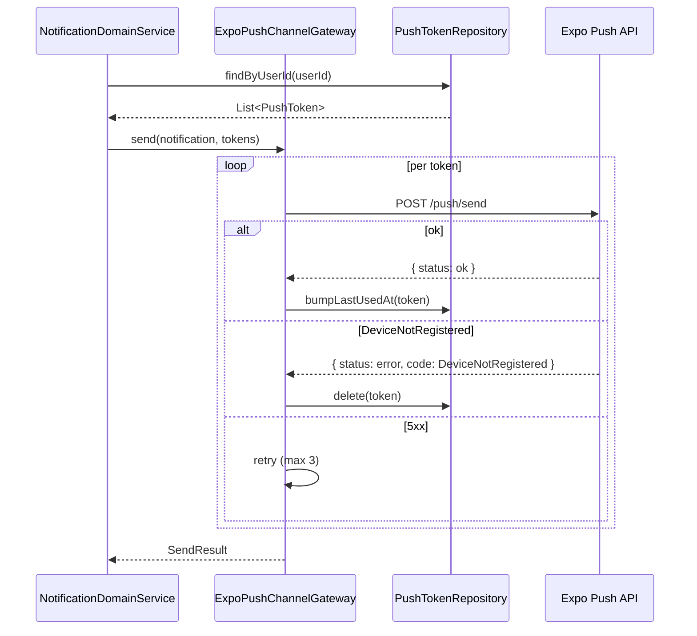
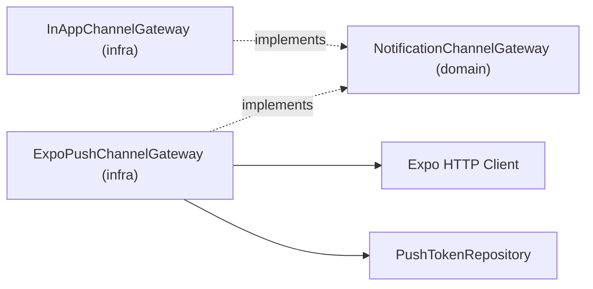

# [NOTIFICATION-06] Expo Push Service Gateway 구현

## 작업 내용 (설계 의도)

### 변경 사항

`NotificationChannelGateway`의 `PUSH` 채널 구현체 `ExpoPushChannelGateway`를 infrastructure에 추가한다.

발송 흐름:
1. `NotificationDomainService`가 발송 시 사용자 ID로 `PushTokenRepository.findByUserId` 호출 → 활성 토큰 N개 획득.
2. 토큰별로 Expo Push API(`https://exp.host/--/api/v2/push/send`) POST 요청.
3. Expo 응답 status별 처리:
   - `ok` → Notification.markSent + `PushToken.lastUsedAt` 갱신
   - `DeviceNotRegistered` → 해당 PushToken 삭제 (자동 정리)
   - `MessageTooBig` / `InvalidCredentials` → Notification.markFailed + 알림 큐 보존

Retry: 일시 오류(5xx, 네트워크) 시 Spring `@Retryable` 3회 + 지수 백오프 1s/3s/9s. 영구 실패는 즉시 markFailed.

PRD §FR-09를 V1 범위 안으로 끌어옴 — 인앱(NOTIFICATION-02) + 푸시(본 티켓) 2채널 V1, 이메일/SMS는 V2.

## 다이어그램

### 처리 흐름

### 클래스 의존

## 테스트 케이스

### 단위 테스트 (Unit)
| ID | 대상 | 케이스 |
|---|---|---|
| U-01 | `ExpoPushChannelGateway` | Expo `ok` 응답 시 SendResult가 SUCCESS로 반환된다 |
| U-02 | `ExpoPushChannelGateway` | `DeviceNotRegistered` 응답 시 PushTokenRepository.delete가 호출된다 |
| U-03 | `ExpoPushChannelGateway` | 5xx 응답 시 3회 retry 후 실패하면 FAILED 결과를 반환한다 |
| U-04 | 페이로드 변환 | Notification.payload → Expo `{to, title, body, data: {deepLink}}` 형식으로 변환된다 |

### 레포지토리 테스트 (Repository / Persistence)
| ID | 대상 | 케이스 |
|---|---|---|
| R-01 | PushToken cleanup | DeviceNotRegistered 응답 후 해당 토큰이 DB에서 삭제된다 |
| R-02 | lastUsedAt 갱신 | ok 응답 후 PushToken.lastUsedAt이 트랜잭션 커밋과 함께 갱신된다 |

### 시나리오 테스트 (Scenario / Integration)
| ID | 시나리오 | 케이스 |
|---|---|---|
| S-01 | 발송 라운드트립 (WireMock Expo) | `ticket.issued.v1` consume → Expo mock에 1회 POST + 200 응답 + Notification SENT |
| S-02 | 부분 실패 처리 | 사용자가 2개 디바이스 보유 시 1개 ok + 1개 DeviceNotRegistered면 한 토큰만 삭제되고 Notification은 SENT |
| S-03 | 일시 오류 retry | Expo가 첫 호출에 503, 두 번째에 200 응답 시 retry 후 정상 발송된다 |
| S-04 | 멱등성 | 동일 Notification 재발송 시도 시 Expo는 1회만 호출된다 (status 가드) |
