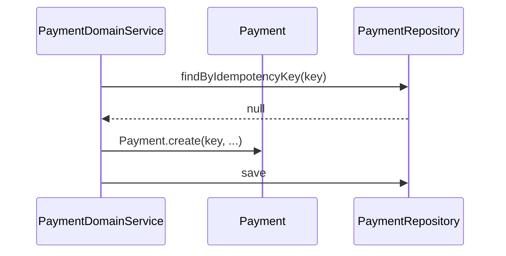
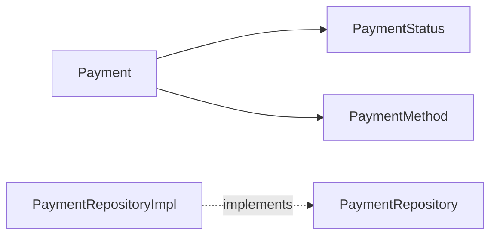

# [PAYMENT-01] Payment Entity + 멱등 키 + 도메인

## 작업 내용 (설계 의도)

### 변경 사항

`domain.payment` 패키지에 `Payment`, `PaymentStatus` enum, `PaymentMethod` enum, `PaymentRepository`를 정의한다.

`Payment` 필드: `id`, `userId`, `idempotencyKey`(unique), `orderType`(BOOKING/TICKETING/GOODS), `orderId`(상위 도메인 주문 ID), `method`, `amount`, `status`(PENDING/COMPLETED/FAILED/REFUNDED), `createdAt`, `paidAt`.

`idempotencyKey`로 동일 요청 중복 결제를 차단한다. unique index `(idempotency_key)`.

`PaymentStatus.canTransitTo`로 상태 전이 검증. `Payment.markCompleted(paidAt)`, `Payment.markFailed(reason)` 등 Entity 메서드.

Flyway `V4__payment.sql`로 테이블 생성.

## 다이어그램

### 처리 흐름

### 클래스 의존

## 테스트 케이스

### 단위 테스트 (Unit)
| ID | 대상 | 케이스 |
|---|---|---|
| U-01 | `Payment.markCompleted` | PENDING → COMPLETED 전이 시 paidAt이 채워진다 |
| U-02 | `Payment.markCompleted` | COMPLETED 상태 재호출 시 `InvalidPaymentStateException`을 던진다 |
| U-03 | `Payment.markFailed` | reason이 빈 문자열이면 `InvalidFailureReasonException`을 던진다 |
| U-04 | `PaymentStatus.canTransitTo` | 모든 상태 전이 케이스가 표 기반으로 정확히 판단된다 |

### 레포지토리 테스트 (Repository / Persistence)
| ID | 대상 | 케이스 |
|---|---|---|
| R-01 | `payments.idempotency_key` | unique 인덱스 위반 시 `DataIntegrityViolationException`이 발생한다 |
| R-02 | `findByIdempotencyKey` | unique 인덱스를 사용함을 explain plan으로 확인한다 |
| R-03 | ZonedDateTime paidAt | UTC 기준 저장 후 동일 instant로 복원된다 |

### 시나리오 테스트 (Scenario / Integration)
| ID | 시나리오 | 케이스 |
|---|---|---|
| S-01 | 멱등 키 hit | 동일 idempotencyKey 두 번 호출 시 두 번째는 PG 호출 없이 기존 Payment를 반환한다 |
