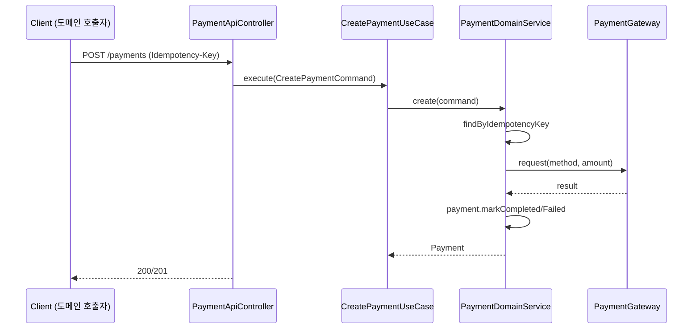
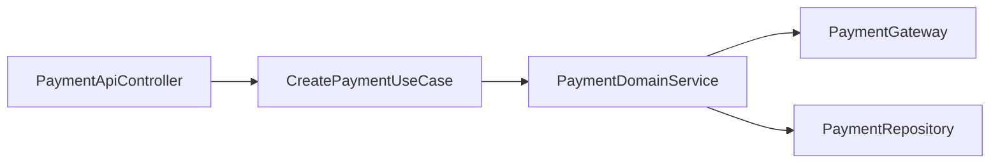

# [PAYMENT-02] 결제 생성 UseCase + API

## 작업 내용 (설계 의도)

### 변경 사항

`POST /payments` 엔드포인트. Request에 `idempotencyKey`(헤더 `Idempotency-Key`), `orderType`, `orderId`, `method`, `amount`. `CreatePaymentUseCase`는 `PaymentDomainService.create(command)` 호출.

DomainService 흐름:
1. 멱등 키 조회 — hit이면 기존 Payment 반환.
2. PG 어댑터(PAYMENT-03) 호출. 결제 요청 송신.
3. PG 응답을 기반으로 `Payment.markCompleted` or `markFailed`.
4. save + 도메인 이벤트 적재.

UseCase는 DomainService만 호출. Repository / Gateway 직접 참조 금지.

## 다이어그램

### 처리 흐름

### 클래스 의존

## 테스트 케이스

### 단위 테스트 (Unit)
| ID | 대상 | 케이스 |
|---|---|---|
| U-01 | `CreatePaymentUseCase` | 멱등 키 miss 시 PG 호출 + Payment 생성, hit 시 기존 Payment 반환 분기가 정확히 동작한다 (MockK) |
| U-02 | `PaymentDomainService` | PG 응답에 따라 markCompleted 또는 markFailed를 정확히 호출한다 |
| U-03 | `CreatePaymentUseCase` | `Idempotency-Key` 헤더 누락 시 `MissingIdempotencyKeyException`을 던진다 |

### 레포지토리 테스트 (Repository / Persistence)
| ID | 대상 | 케이스 |
|---|---|---|
| R-01 | `payments` unique 제약 | 동시 두 트랜잭션이 동일 idempotencyKey INSERT 시도 시 1건만 성공한다 |

### 시나리오 테스트 (Scenario / Integration)
| ID | 시나리오 | 케이스 |
|---|---|---|
| S-01 | 멱등 호출 | 동일 헤더 두 요청은 같은 paymentId 반환 + PG mock 1회만 호출된다 |
| S-02 | 다른 키 | 다른 idempotencyKey로 두 요청은 두 Payment row를 생성한다 |
| S-03 | 입력 검증 | 음수 amount 요청 시 422 ProblemDetail 응답이 반환된다 |
