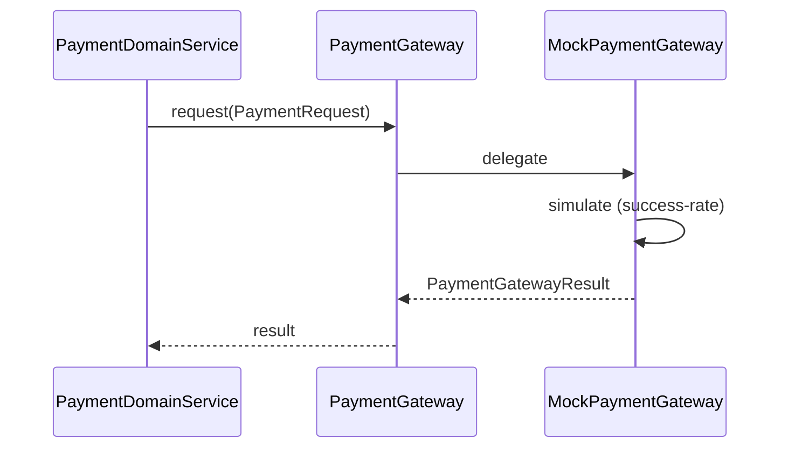
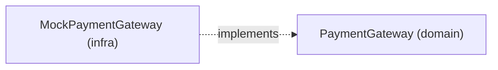

# [PAYMENT-03] PG 어댑터 mock 구현 (Gateway interface)

## 작업 내용 (설계 의도)

### 변경 사항

`domain.payment` 패키지에 `PaymentGateway` interface 정의. 메서드: `request(PaymentRequest): PaymentGatewayResult`.

infrastructure에 `MockPaymentGateway` 구현체. `application.yml`의 `app.payment.mock.success-rate` (기본 1.0) 기반 확정적 결과. amount=0이거나 음수면 실패. 실 PG는 V2에서 추가.

interface 분리 이유: Toss/Iamport/Naver 등 실제 PG 어댑터를 추가하더라도 도메인 코드는 무변경.

mock은 짧은 인위적 지연(`Thread.sleep(50ms)`)을 둬 통합 테스트에서 비동기 흐름을 흉내.

## 다이어그램

### 처리 흐름

### 클래스 의존

## 테스트 케이스

### 단위 테스트 (Unit)
| ID | 대상 | 케이스 |
|---|---|---|
| U-01 | `MockPaymentGateway` | amount ≤ 0 입력 시 항상 실패 결과를 반환한다 |
| U-02 | `MockPaymentGateway` | success-rate=0.0이면 항상 실패, 1.0이면 항상 성공한다 |
| U-03 | `MockPaymentGateway` | success-rate=0.5에서 100회 호출 시 성공/실패 분포가 균등하다 (±15%) |
| U-04 | `MockPaymentGateway` | 인위적 지연 50ms 이상이 발생한다 |

### 레포지토리 테스트 (Repository / Persistence)
| ID | 대상 | 케이스 |
|---|---|---|
| R-01 | — | 본 티켓은 외부 게이트웨이만 다루므로 별도 Repository 없음 |

### 시나리오 테스트 (Scenario / Integration)
| ID | 시나리오 | 케이스 |
|---|---|---|
| S-01 | 빈 활성화 | `PaymentGateway` 빈 주입 시 `@Profile` 설정대로 MockPaymentGateway가 활성화된다 |
| S-02 | 교체 가능성 | 실 PG 어댑터로 교체 가능한 interface 구조를 ArchUnit 룰로 검증한다 |
