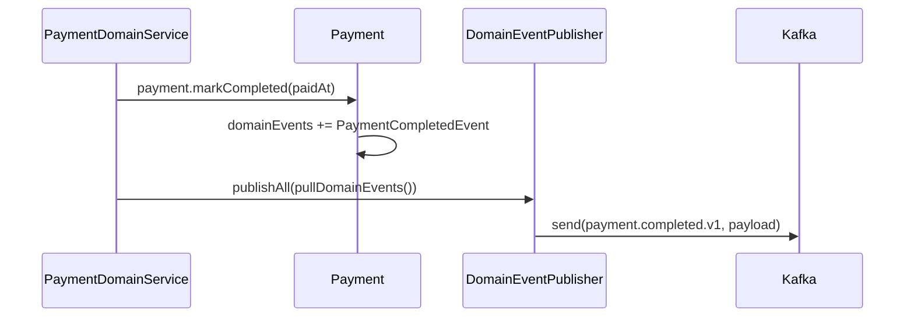
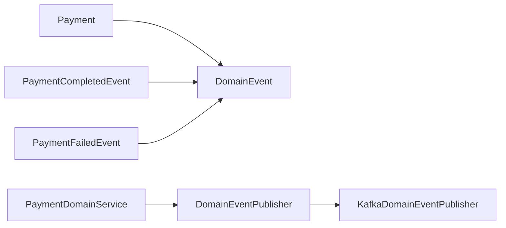

# [PAYMENT-04] payment.completed/failed Kafka 발행

## 작업 내용 (설계 의도)

### 변경 사항

`Payment.markCompleted` / `markFailed` 호출 시 Entity 내부 `domainEvents`에 `PaymentCompletedEvent` / `PaymentFailedEvent`를 적재한다.

DomainService가 `eventPublisher.publishAll(payment.pullDomainEvents())`로 발행. infrastructure의 `KafkaDomainEventPublisher`가 라우팅 규칙대로 `payment.completed.v1` / `payment.failed.v1` 토픽으로 발행.

페이로드:
```json
{ "paymentId": 1, "orderType": "BOOKING", "orderId": 7, "amount": 30000, "paidAt": "..." }
```

`@TransactionalEventListener(AFTER_COMMIT)`을 활용해 트랜잭션 커밋 후에만 외부 발행되도록 보장.

## 다이어그램

### 처리 흐름



### 클래스 의존



## 테스트 케이스

### 단위 테스트 (Unit)
| ID | 대상 | 케이스 |
|---|---|---|
| U-01 | `Payment.markCompleted` | `PaymentCompletedEvent`가 domainEvents에 적재된다 |
| U-02 | `Payment.markFailed` | `PaymentFailedEvent`가 reason 포함하여 적재된다 |
| U-03 | `Payment.pullDomainEvents` | 호출 후 내부 리스트가 비워진다 |

### 레포지토리 테스트 (Repository / Persistence)
| ID | 대상 | 케이스 |
|---|---|---|
| R-01 | `@TransactionalEventListener(AFTER_COMMIT)` | 트랜잭션 커밋 후에만 토픽 발행이 일어난다 |
| R-02 | 트랜잭션 롤백 | 롤백 시 토픽에 0건 발행된다 |

### 시나리오 테스트 (Scenario / Integration)
| ID | 시나리오 | 케이스 |
|---|---|---|
| S-01 | 페이로드 검증 | `payment.completed.v1` 페이로드에 paymentId/orderType/orderId/amount/paidAt 5개 필드가 포함된다 |
| S-02 | 중복 발행 방지 | Payment 트랜잭션 커밋 후 토픽에 정확히 1건만 발행된다 |
| S-03 | consumer 라운드트립 | consumer가 발행 후 5초 내 메시지를 수신한다 |
