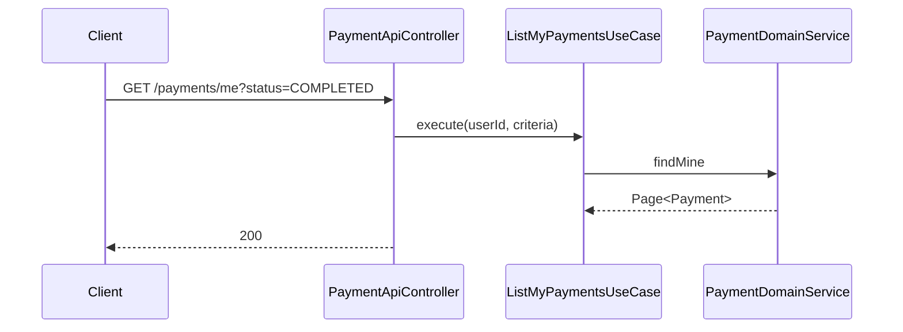
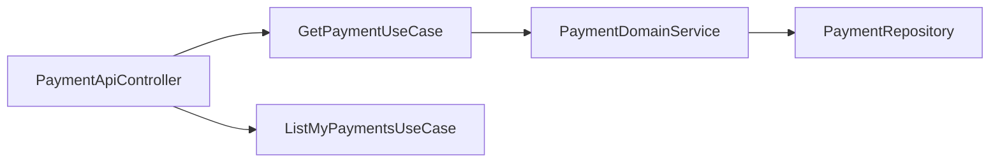

# [PAYMENT-05] 결제 조회 API (단건·사용자별)

## 작업 내용 (설계 의도)

### 변경 사항

`GET /payments/{id}` 단건, `GET /payments/me` 본인 결제 목록 (상태 필터 + 페이지네이션).

`GetPaymentUseCase`, `ListMyPaymentsUseCase`. 본인 결제만 조회 가능 — `@PreAuthorize("@authz.isOwner(#userId)")` 또는 UseCase 내부에서 SecurityContext와 paymentId 일치 검사 (DomainService에 위임).

QueryDSL CustomRepository로 `userId + status + paidAt 범위` 조건. `@Query` 금지.

응답 필드: `id, orderType, orderId, method, amount, status, createdAt, paidAt`.

## 다이어그램

### 처리 흐름

### 클래스 의존

## 테스트 케이스

### 단위 테스트 (Unit)
| ID | 대상 | 케이스 |
|---|---|---|
| U-01 | `GetPaymentUseCase` | 본인 paymentId가 아니면 `NotPaymentOwnerException`을 던진다 |
| U-02 | `GetPaymentUseCase` | ADMIN Role은 모든 paymentId를 조회할 수 있다 |

### 레포지토리 테스트 (Repository / Persistence)
| ID | 대상 | 케이스 |
|---|---|---|
| R-01 | `PaymentQueryDslRepository` | `(userId, status, paidAt 범위)` 조건이 인덱스 `(user_id, status, paid_at)`을 사용한다 |
| R-02 | 페이지네이션 | createdAt desc 안정 정렬로 동작한다 |

### 시나리오 테스트 (Scenario / Integration)
| ID | 시나리오 | 케이스 |
|---|---|---|
| S-01 | 본인 결제 조회 | `GET /payments/me?status=COMPLETED`가 본인 결제만 페이지네이션으로 반환한다 |
| S-02 | 인가 위반 | 타인 paymentId 단건 조회 시 403 응답이 반환된다 |
| S-03 | 민감 정보 마스킹 | 응답 본문에서 카드번호 같은 민감 정보가 마스킹된다 |
