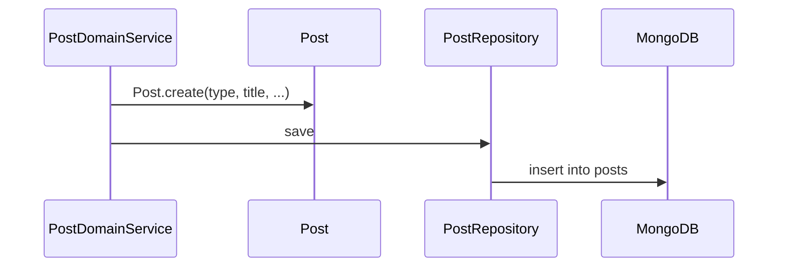
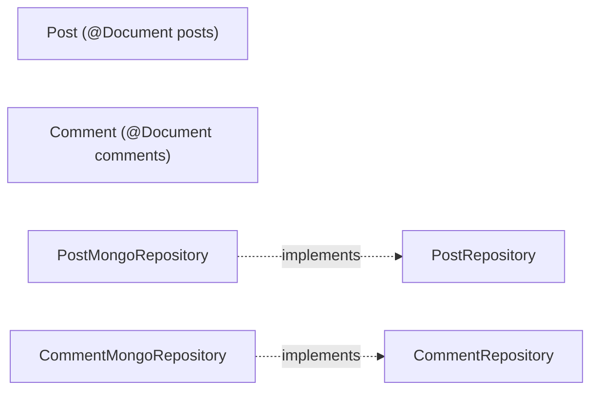

# [POST-01] Post·Comment Mongo 컬렉션 + 도메인 (분리 모델)

## 작업 내용 (설계 의도)

### 변경 사항

`domain.post` 패키지에 `Post`, `Comment` 두 도큐먼트를 별도 컬렉션으로 분리한다. 레거시는 Post 내부에 comments 배열 임베드였지만, 16MB 한계와 부분 갱신 비용 때문에 신규는 분리.

`Post`: `id`, `type`(NOTICE/FREE/QNA/MATCH), `title`, `content`, `userId`(MySQL User.id 참조), `writer`(닉네임 스냅샷), `createdAt`(ZonedDateTime).
`Comment`: `id`, `postId`, `content`, `userId`, `writer`, `createdAt`.

인덱스:
- posts: `userId`, `type`, `createdAt desc`, text index on `title+content`.
- comments: `(postId, createdAt asc)`, `userId`.

`PostRepository`, `CommentRepository` interface는 도메인 패키지에 정의, infrastructure에서 Spring Data MongoDB로 구현.

## 다이어그램

### 처리 흐름

### 클래스 의존

## 테스트 케이스

### 단위 테스트 (Unit)
| ID | 대상 | 케이스 |
|---|---|---|
| U-01 | `Post.create` | 빈 title 입력 시 `InvalidPostException`을 던진다 |
| U-02 | `Post.changeContent` | 본인 호출은 성공, 타인 호출은 `NotPostOwnerException`을 던진다 |
| U-03 | `Comment.create` | content 길이 > 1000자면 `CommentTooLongException`을 던진다 |

### 레포지토리 테스트 (Repository / Persistence)
| ID | 대상 | 케이스 |
|---|---|---|
| R-01 | `PostMongoRepository` | save → findById 라운드트립으로 모든 필드(ZonedDateTime zone 포함)가 보존된다 |
| R-02 | text index | `findByTextSearch("검색어")`가 title/content 모두에서 매치한다 |
| R-03 | `(postId, createdAt asc)` 인덱스 | `findByPostId(id, pageable)`가 인덱스를 사용함을 explain plan으로 확인한다 |

### 시나리오 테스트 (Scenario / Integration)
| ID | 시나리오 | 케이스 |
|---|---|---|
| S-01 | 대량 댓글 조회 | 1만 Comment Post에 대해 `findCommentsByPostId(pageSize=20)` P95가 50ms 이하다 |
| S-02 | 임베드 한계 해소 | Post 도큐먼트 크기가 16MB에 도달하지 않음을 분리 모델 적용 후 검증한다 |
