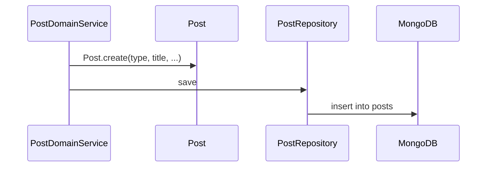
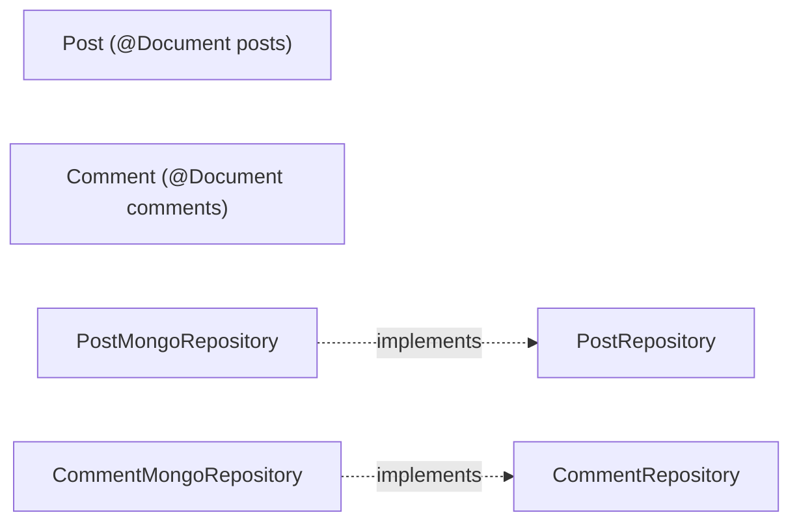

# [POST-01] Post·Comment 도메인 (MySQL + JPA 단일 모델)

## 작업 내용 (설계 의도)

### 변경 사항

> **DB 결정 변경 (2026-05-20)**: 당초 MongoDB 였으나 Post–Comment 는 본질적으로 관계형(1:N, 댓글 수 집계, 모더레이션 일관성)이라 **MySQL + JPA 로 통합**한다. Mongo 는 Facility 만 사용. `be-code-convention.md` "JPA Entity = Domain Entity" 단일 모델 + `JpaAuditingBase` 상속.

`domain.post` 패키지에 `Post`, `Comment` 를 **JPA `@Entity`(= 도메인 Entity, 단일 모델)** 로 정의한다. 별도 영속화 POJO/매퍼 금지.

`Post`: `id`(PK), `type`(NOTICE/FREE/QNA/MATCH — VARCHAR + app enum), `title`, `content`(TEXT), `userId`(User.id FK 컬럼, 연관객체 금지), `writer`(닉네임 스냅샷), audit 6컬럼(JpaAuditingBase).
`Comment`: `id`(PK), `postId`(FK 컬럼), `content`, `userId`, `writer`, audit 6컬럼.

> Post–Comment 는 별개 aggregate. Comment 는 `@ManyToOne Post` 가 아니라 `postId: Long` 만 보유. Post 의 댓글 목록은 `CommentRepository.findByPostId(postId)` 명시 쿼리.

인덱스 (V*__create_posts_comments.sql, DATETIME(6)/FK·ENUM 금지):
- posts: `idx_posts_user_id(user_id)`, `idx_posts_type_deleted_at(type, deleted_at)`, `idx_posts_created_at(created_at)`.
- comments: `idx_comments_post_id_created_at(post_id, created_at)`, `idx_comments_user_id(user_id)`.
- 전문 검색(title+content)은 후속 티켓(POST-02)에서 검토 — 본 티켓 범위 제외.

`PostRepository`, `CommentRepository` interface 는 도메인 패키지에 정의, infrastructure 에서 Spring Data JPA(`JpaRepository<Post, Long>`) + QueryDSL CustomRepositoryImpl 로 구현.

## 다이어그램

### 처리 흐름

### 클래스 의존

## 테스트 케이스

### 단위 테스트 (Unit)
| ID | 대상 | 케이스 |
|---|---|---|
| U-01 | `Post.create` | 빈 title 입력 시 `InvalidPostException`을 던진다 |
| U-02 | `Post.changeContent` | 본인 호출은 성공, 타인 호출은 `NotPostOwnerException`을 던진다 |
| U-03 | `Comment.create` | content 길이 > 1000자면 `CommentTooLongException`을 던진다 |

### 레포지토리 테스트 (Repository / Persistence)
| ID | 대상 | 케이스 |
|---|---|---|
| R-01 | `PostMongoRepository` | save → findById 라운드트립으로 모든 필드(ZonedDateTime zone 포함)가 보존된다 |
| R-02 | text index | `findByTextSearch("검색어")`가 title/content 모두에서 매치한다 |
| R-03 | `(postId, createdAt asc)` 인덱스 | `findByPostId(id, pageable)`가 인덱스를 사용함을 explain plan으로 확인한다 |

### 시나리오 테스트 (Scenario / Integration)
| ID | 시나리오 | 케이스 |
|---|---|---|
| S-01 | 대량 댓글 조회 | 1만 Comment Post에 대해 `findCommentsByPostId(pageSize=20)` P95가 50ms 이하다 |
| S-02 | 임베드 한계 해소 | Post 도큐먼트 크기가 16MB에 도달하지 않음을 분리 모델 적용 후 검증한다 |
