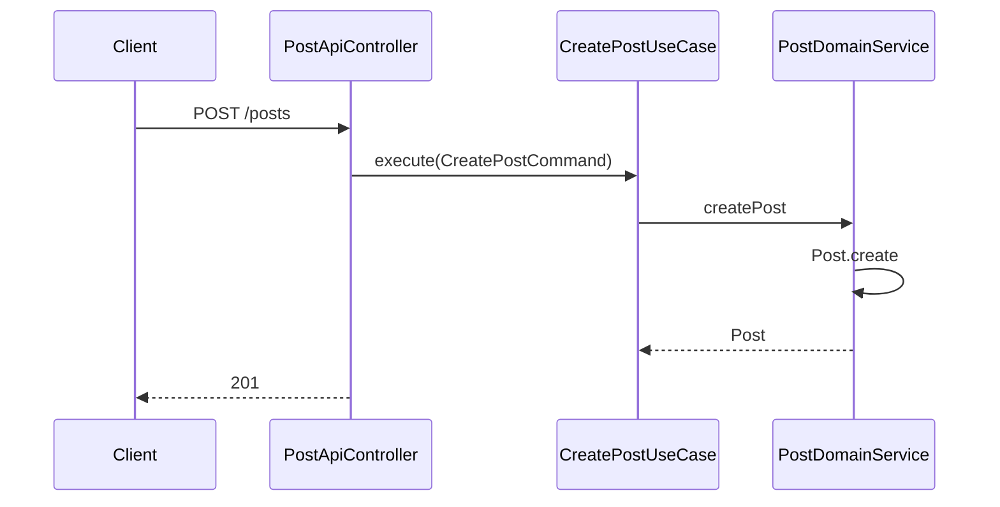
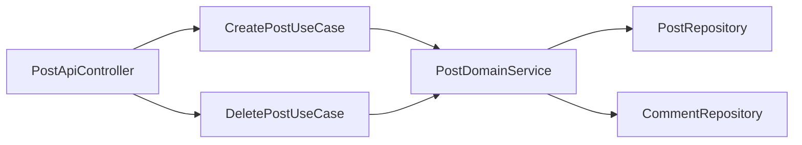

# [POST-02] 게시글 생성·삭제 API

## 작업 내용 (설계 의도)

### 변경 사항

`POST /posts` 생성, `DELETE /posts/{id}` 삭제. 생성은 인증 필요. 삭제는 본인 또는 ADMIN만.

`CreatePostUseCase`, `DeletePostUseCase`. DomainService가 `Post.create` / `Post.delete` 호출. 삭제 시 연관 Comment도 함께 삭제 (cascade — DomainService 내부에서 두 컬렉션 모두 제거).

`writer`는 SecurityContext의 `UserPrincipal.nickname` 스냅샷을 사용. 닉네임 변경 시 기존 글의 writer는 변경되지 않음 (의도된 스냅샷 정책).

## 다이어그램

### 처리 흐름

### 클래스 의존

## 테스트 케이스

### 단위 테스트 (Unit)
| ID | 대상 | 케이스 |
|---|---|---|
| U-01 | `DeletePostUseCase` | 본인이 아닌 사용자 호출 시 `NotPostOwnerException`을 던진다 |
| U-02 | `DeletePostUseCase` | ADMIN Role은 타인 Post도 삭제 가능하다 |
| U-03 | `Post.delete` | 이미 삭제된 Post 재호출 시 `PostAlreadyDeletedException`을 던진다 |

### 레포지토리 테스트 (Repository / Persistence)
| ID | 대상 | 케이스 |
|---|---|---|
| R-01 | Post 삭제 + Comment cascade | Post 삭제 후 연관 Comment 5건이 함께 삭제된다 |
| R-02 | 동시 삭제 | 두 트랜잭션 동시 삭제 시 1건만 성공, 다른 1건은 `PostNotFoundException`을 받는다 |

### 시나리오 테스트 (Scenario / Integration)
| ID | 시나리오 | 케이스 |
|---|---|---|
| S-01 | 정상 생성 | `POST /posts` 201 + Location 응답 후 `GET /posts/{id}`로 즉시 조회 가능하다 |
| S-02 | 인증·인가 | 미인증 POST는 401, 타인 게시글 DELETE는 403 응답이 반환된다 |
| S-03 | 삭제 후 조회 | 삭제 시나리오 후 동일 ID 조회 시 404 응답이 반환된다 |
