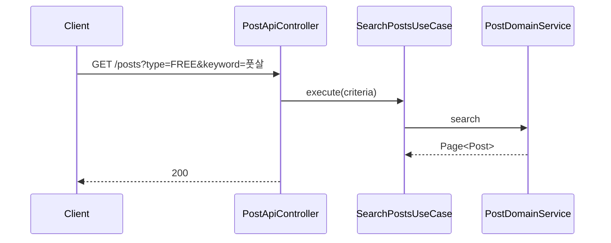
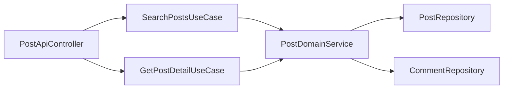

# [POST-03] 게시글 조회 API (목록·유형·사용자·키워드)

## 작업 내용 (설계 의도)

### 변경 사항

조회 API 5종을 단일 Controller에 노출:
- `GET /posts` — 전체 목록 (페이지네이션)
- `GET /posts?type=FREE` — 유형별
- `GET /posts?userId=7` — 사용자별
- `GET /posts?keyword=검색어` — 키워드 검색 (text index)
- `GET /posts/{id}` — 단건 + 댓글 목록 동시 반환 (서브쿼리)

`SearchPostsUseCase`는 Criteria 객체를 받아 MongoTemplate Query로 동적 조건 구성. 정렬은 `createdAt desc` 기본.

단건 조회 응답 DTO에 `comments` 목록(최대 50건) 포함. 그 이상은 별도 `/posts/{id}/comments` 페이지네이션 (POST-04 일부).

## 다이어그램

### 처리 흐름

### 클래스 의존

## 테스트 케이스

### 단위 테스트 (Unit)
| ID | 대상 | 케이스 |
|---|---|---|
| U-01 | `SearchPostsUseCase` | Criteria의 type/userId/keyword 조합이 Query 객체로 변환된다 (MockK) |
| U-02 | `GetPostDetailUseCase` | 미존재 ID 입력 시 `PostNotFoundException`을 던진다 |
| U-03 | `PostDetailResponseMapper` | 댓글이 시간순 정렬되어 응답된다 |

### 레포지토리 테스트 (Repository / Persistence)
| ID | 대상 | 케이스 |
|---|---|---|
| R-01 | `findByType` | 100건 Post에서 `FREE` 페이지 size=20 조회 시 정확히 20건 + 카운트가 일치한다 |
| R-02 | text index | `findByTextSearch("풋살")`가 title/content 모두 매치하고 score 순으로 반환한다 |
| R-03 | `findByUserId` | userId 필터가 정확히 적용된다 |

### 시나리오 테스트 (Scenario / Integration)
| ID | 시나리오 | 케이스 |
|---|---|---|
| S-01 | 복합 조회 | `GET /posts?type=FREE&keyword=풋살&page=0&size=10`이 정확한 필터·페이지네이션 결과를 반환한다 |
| S-02 | 단건+댓글 | 댓글 3건 작성 후 단건 응답에 댓글 3건이 포함된다 |
| S-03 | 공개 API | 인증 없이 조회 호출은 200 응답을 받는다 |
