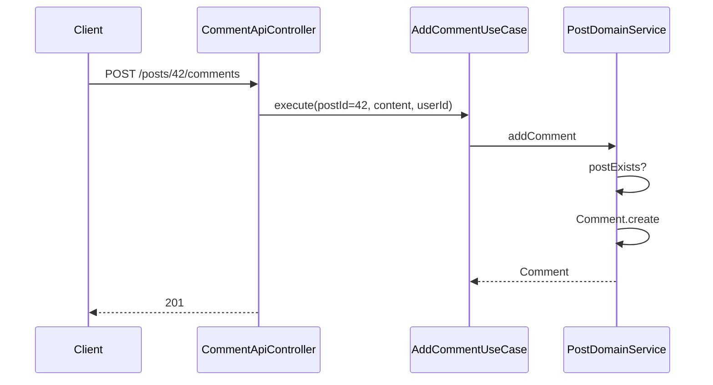
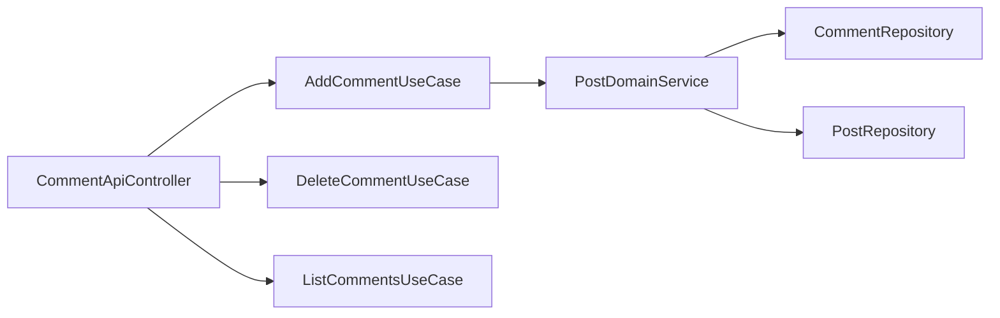

# [POST-04] 댓글 작성·삭제 API

## 작업 내용 (설계 의도)

### 변경 사항

`POST /posts/{postId}/comments` 작성, `DELETE /comments/{id}` 삭제, `GET /posts/{postId}/comments?page=0&size=20` 페이지네이션 조회.

`AddCommentUseCase`는 Post 존재 검증 + Comment.create + save. `DeleteCommentUseCase`는 본인 또는 ADMIN만.

Post가 삭제된 상태면 댓글 작성 불가 (`PostDeletedException` → 404 또는 409).

## 다이어그램

### 처리 흐름

### 클래스 의존

## 테스트 케이스

### 단위 테스트 (Unit)
| ID | 대상 | 케이스 |
|---|---|---|
| U-01 | `AddCommentUseCase` | 미존재 Post에 댓글 작성 시 `PostNotFoundException`을 던진다 |
| U-02 | `Comment.delete` | 본인 호출 성공, 타인 호출 시 `NotCommentOwnerException`을 던진다 |
| U-03 | `DeleteCommentUseCase` | ADMIN Role은 타인 댓글도 삭제 가능하다 |

### 레포지토리 테스트 (Repository / Persistence)
| ID | 대상 | 케이스 |
|---|---|---|
| R-01 | `findByPostId` | createdAt 오름차순으로 페이지네이션 결과를 반환한다 |
| R-02 | 대량 조회 성능 | 1000건 댓글 적재 후 페이지당 20건 조회 P95가 50ms 이하다 |
| R-03 | 동시 작성 | 동일 postId 동시 작성 시 둘 다 저장되고 createdAt이 서로 다르다 |

### 시나리오 테스트 (Scenario / Integration)
| ID | 시나리오 | 케이스 |
|---|---|---|
| S-01 | 정상 작성 | `POST /posts/{id}/comments` 201 → `GET /posts/{id}/comments`로 즉시 조회된다 |
| S-02 | 인가 | Post 작성자가 타인 댓글을 삭제 시도 시 403 응답이 반환된다 |
| S-03 | Cascade | 게시글 삭제 시 댓글 5건이 함께 삭제되어 댓글 목록이 empty 또는 404다 |
