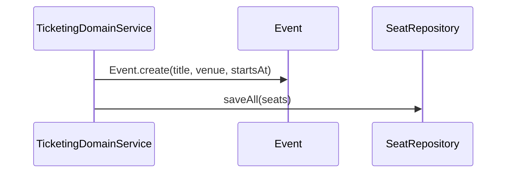
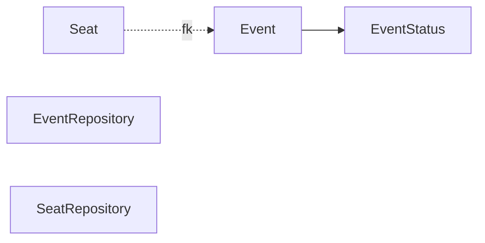

# [TICKETING-01] Event·Seat Entity + 도메인

## 작업 내용 (설계 의도)

### 변경 사항

`domain.ticketing` 패키지에 `Event`, `Seat`, `EventRepository`, `SeatRepository`를 정의한다.

`Event`: `id`, `title`, `venue`, `startsAt`(ZonedDateTime), `status`(SCHEDULED / OPEN / CLOSED / CANCELLED).
`Seat`: `id`, `eventId`, `section`, `rowNo`, `seatNo`, `price`, unique `(eventId, section, rowNo, seatNo)`.

`Event.openSales()`, `Event.close()` 등 Entity 비즈니스 메서드. 좌석은 Event와 함께 생성하며 단순 데이터 컨테이너 — 좌석 자체에는 사용 상태가 없고 Redis 락 + Ticket 발권으로 점유 여부를 표현.

Flyway `V5__ticketing.sql`로 `events`, `seats` 테이블 + 인덱스.

## 다이어그램

### 처리 흐름

### 클래스 의존

## 테스트 케이스

### 단위 테스트 (Unit)
| ID | 대상 | 케이스 |
|---|---|---|
| U-01 | `Event.openSales` | SCHEDULED 상태에서 OPEN으로 전이되고 CLOSED 상태에서는 `InvalidEventStateException`을 던진다 |
| U-02 | `Event.close` | OPEN → CLOSED 전이만 허용하고 SCHEDULED에서는 예외를 던진다 |
| U-03 | `Seat.equals` | (eventId, section, rowNo, seatNo) 4튜플이 같으면 객체 동등성이 true다 |

### 레포지토리 테스트 (Repository / Persistence)
| ID | 대상 | 케이스 |
|---|---|---|
| R-01 | `seats` unique 제약 | (event_id, section, row_no, seat_no) 중복 INSERT 시 위반된다 |
| R-02 | `findByEventId` | 인덱스를 사용해 정렬된 결과를 반환한다 |
| R-03 | Cascade | Event 삭제 시 연관 Seat가 함께 삭제된다 |

### 시나리오 테스트 (Scenario / Integration)
| ID | 시나리오 | 케이스 |
|---|---|---|
| S-01 | 일괄 INSERT 성능 | 100좌석 일괄 INSERT 트랜잭션이 5초 내 완료된다 |
| S-02 | 트랜잭션 롤백 | 중간 unique 제약 위반 시 전체 트랜잭션이 롤백된다 |
