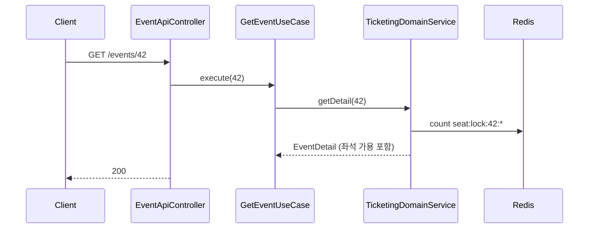
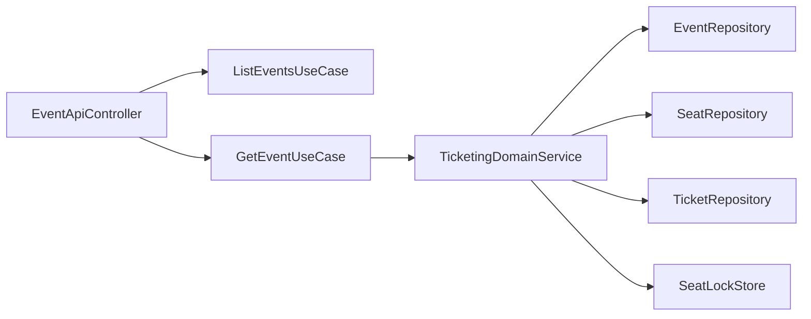

# [TICKETING-02] 경기 목록·단건 조회 API

## 작업 내용 (설계 의도)

### 변경 사항

`GET /events` 목록 (필터: 날짜 범위, 상태), `GET /events/{id}` 단건 + 좌석 가용 정보.

단건 응답에 섹션별 잔여 좌석 수를 포함. 잔여 좌석 계산: 전체 좌석 - 발권된 Ticket - 현재 Redis 락 키 카운트.

`ListEventsUseCase`, `GetEventUseCase`. ADMIN/OWNER만 `POST /events` 가능 (별도 ADMIN API는 후속 트랙).

응답에 startsAt은 ZonedDateTime ISO 8601. 절대 LocalDateTime 사용 금지 (harness-rules).

## 다이어그램

### 처리 흐름

### 클래스 의존

## 테스트 케이스

### 단위 테스트 (Unit)
| ID | 대상 | 케이스 |
|---|---|---|
| U-01 | `AvailableSeatCalculator` | `전체 - 발권 - 락` 공식이 다양한 입력에 대해 정확한 결과를 낸다 |
| U-02 | `GetEventUseCase` | 미존재 ID 입력 시 `EventNotFoundException`을 던진다 |
| U-03 | `EventResponseSerializer` | startsAt이 ZonedDateTime ISO 8601로 직렬화된다 (LocalDateTime 금지) |

### 레포지토리 테스트 (Repository / Persistence)
| ID | 대상 | 케이스 |
|---|---|---|
| R-01 | 잔여 좌석 계산 | 100석 - 발권 30 - 락 10 = 60으로 정확히 계산된다 |
| R-02 | Redis 락 카운트 | `SCAN seat:lock:42:*` 패턴 매칭이 정확한 카운트를 반환한다 |

### 시나리오 테스트 (Scenario / Integration)
| ID | 시나리오 | 케이스 |
|---|---|---|
| S-01 | 필터 응답 | `GET /events?status=OPEN&date=...` 필터가 정확한 결과를 반환한다 |
| S-02 | 공개 API | 인증 없이도 Event 조회는 200 응답을 받는다 |
| S-03 | 실시간 반영 | 락 변경이 발생한 직후 단건 조회에 가용 좌석 수가 갱신된다 |
