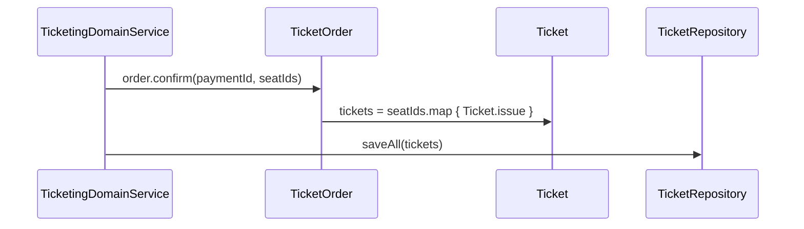
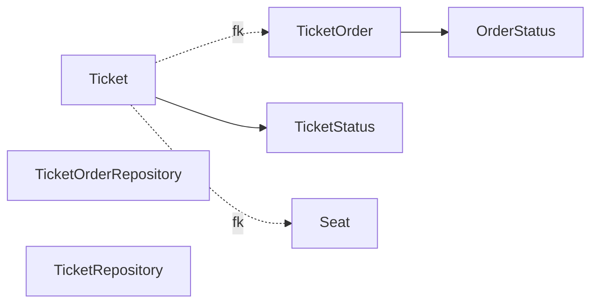

# [TICKETING-03] Ticket·TicketOrder Entity + 도메인

## 작업 내용 (설계 의도)

### 변경 사항

`Ticket`, `TicketOrder`, `TicketStatus` enum, 두 Repository를 추가한다.

`TicketOrder`: 결제 단위. `id`, `userId`, `status`(PENDING/CONFIRMED/CANCELLED), `paymentId`(nullable), `lockedEventId`(좌석 락 해제용), `lockedSeatIds`(JSON 배열).
`Ticket`: 좌석 1개 = 티켓 1개. `id`, `ticketOrderId`, `seatId`, `status`(ISSUED/REVOKED), `code`(QR/바코드 식별자).

`TicketOrder.confirm(paymentId, ticketsToIssue)` — PENDING → CONFIRMED + Ticket 일괄 발권.
`Ticket.revoke()` — 환불 시 ISSUED → REVOKED.

Flyway `V6__ticketing_order.sql`로 `ticket_orders`, `tickets` 테이블 생성. **부분 unique 인덱스를 DDL로 명시**해 Redis 락 장애 시에도 DB 레벨에서 over-sell을 차단한다:

<details>
<summary>DDL 참고</summary>

```sql
CREATE TABLE tickets (
  id BIGINT PRIMARY KEY AUTO_INCREMENT,
  ticket_order_id BIGINT NOT NULL,
  seat_id BIGINT NOT NULL,
  status VARCHAR(20) NOT NULL,
  code VARCHAR(64) NOT NULL UNIQUE,
  created_at TIMESTAMP(6) NOT NULL,
  CONSTRAINT fk_tickets_order FOREIGN KEY (ticket_order_id) REFERENCES ticket_orders(id),
  CONSTRAINT fk_tickets_seat FOREIGN KEY (seat_id) REFERENCES seats(id)
);

-- MySQL은 부분 인덱스 미지원. status=ISSUED 단일 강제는 생성된 컬럼 + UNIQUE로 구현
ALTER TABLE tickets
  ADD COLUMN active_seat_id BIGINT GENERATED ALWAYS AS (
    CASE WHEN status='ISSUED' THEN seat_id ELSE NULL END
  ) VIRTUAL,
  ADD UNIQUE KEY uk_tickets_active_seat (active_seat_id);
```
</details>

## 다이어그램

### 처리 흐름



### 클래스 의존



## 테스트 케이스

### 단위 테스트 (Unit)
| ID | 대상 | 케이스 |
|---|---|---|
| U-01 | `TicketOrder.confirm` | PENDING 상태에서만 호출 가능, 다른 상태는 `InvalidOrderStateException` |
| U-02 | `Ticket.revoke` | ISSUED → REVOKED 전이만 허용된다 |
| U-03 | `Ticket.code` | 발급 시 256-bit 엔트로피의 unique 식별자가 생성된다 |

### 레포지토리 테스트 (Repository / Persistence)
| ID | 대상 | 케이스 |
|---|---|---|
| R-01 | 부분 unique 인덱스 | `(seat_id) WHERE status='ISSUED'`가 동일 좌석 ISSUED 두 건 INSERT 시 위반된다 |
| R-02 | REVOKED 좌석 재발권 | REVOKED 티켓이 있는 좌석에 새 ISSUED 발권은 성공한다 |
| R-03 | 일괄 INSERT | TicketOrder.confirm 호출 시 N개 Ticket이 단일 트랜잭션 내에서 처리된다 |

### 시나리오 테스트 (Scenario / Integration)
| ID | 시나리오 | 케이스 |
|---|---|---|
| S-01 | 동시 발권 충돌 | 두 사용자가 같은 좌석으로 confirm 시도 시 1건만 성공, 1건은 `DuplicateTicketException` |
