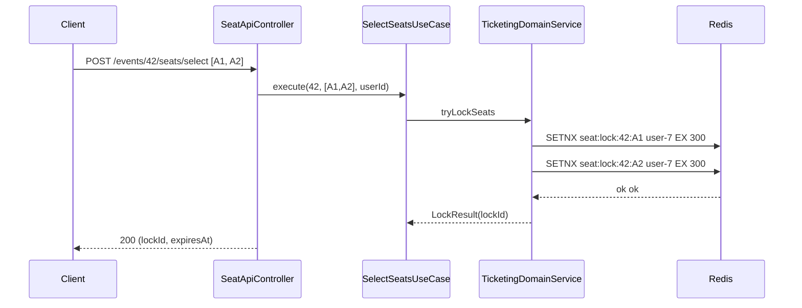
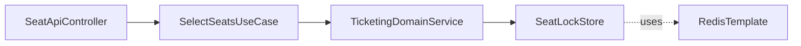

# [TICKETING-04] 좌석 선택 UseCase + Redis 5분 락

## 작업 내용 (설계 의도)

### 변경 사항

`POST /events/{eventId}/seats/select` — 사용자가 좌석 N개를 선택. Redis에 `seat:lock:{eventId}:{seatId}` 키로 5분 TTL 락을 획득한다. 한 사용자가 다수 좌석을 한 요청에 락 가능.

`SelectSeatsUseCase`는 `TicketingDomainService.tryLockSeats(eventId, seatIds, userId)` 호출. DomainService 흐름:
1. 각 좌석에 대해 `SETNX seat:lock:{eventId}:{seatId} {userId} EX 300`.
2. 1개라도 실패하면 이미 획득한 좌석을 모두 해제(롤백) 후 `SeatAlreadyLockedException` → 409.
3. 전부 성공하면 `lockId` (조합) 반환.

이후 결제는 `lockId`를 들고 `POST /ticket-orders` 호출 (TICKETING-05).

## 다이어그램

### 처리 흐름

### 클래스 의존

## 테스트 케이스

### 단위 테스트 (Unit)
| ID | 대상 | 케이스 |
|---|---|---|
| U-01 | `SelectSeatsUseCase` | 일부 좌석 락 실패 시 이미 획득한 좌석을 모두 해제하는 롤백 로직이 동작한다 (MockK) |
| U-02 | `SelectSeatsUseCase` | 좌석 1개라도 본인 락이 아니면 전체 요청이 실패한다 |
| U-03 | `SelectSeatsUseCase` | 빈 seatIds 입력 시 `EmptySeatSelectionException`을 던진다 |

### 레포지토리 테스트 (Repository / Persistence)
| ID | 대상 | 케이스 |
|---|---|---|
| R-01 | Redis 락 TTL | `seat:lock:{eventId}:{seatId}` 키가 TTL 300초로 설정된다 |
| R-02 | TTL 자동 해제 | 5분 경과 후 자동 해제되어 다른 사용자가 락 획득 가능하다 |
| R-03 | compare-and-del | 다른 사용자의 락은 해제 불가하다 |

### 시나리오 테스트 (Scenario / Integration)
| ID | 시나리오 | 케이스 |
|---|---|---|
| S-01 | 동시 선택 충돌 | 두 사용자 동시 동일 좌석 선택 시 1명 200, 1명 409 응답이 반환된다 |
| S-02 | 다중 좌석 롤백 | 다수 좌석 선택 중 일부 실패 시 이미 잡힌 락이 모두 롤백된다 |
| S-03 | TTL 갱신 | 보유자가 같은 좌석 재선택 시 TTL이 갱신된다 |
