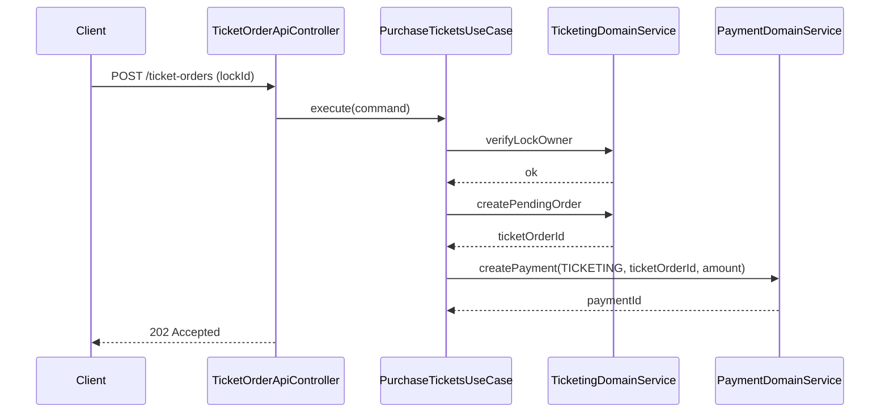
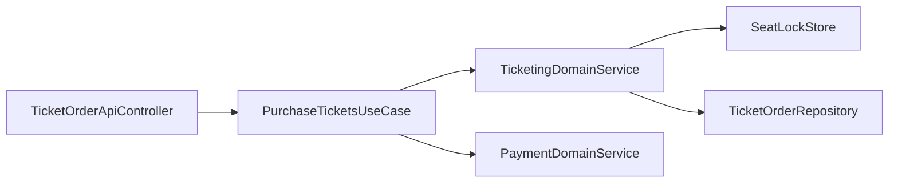

# [TICKETING-05] 티켓 구매 UseCase + Payment 호출

## 작업 내용 (설계 의도)

### 변경 사항

`POST /ticket-orders` — `lockId`(TICKETING-04 결과)와 결제 정보를 받아 PENDING TicketOrder 생성 후 Payment 도메인 호출.

`PurchaseTicketsUseCase` 흐름:
1. lockId의 좌석들이 여전히 본인 락인지 검증(`GET seat:lock:...` 값 == userId).
2. TicketOrder.createPending(userId, totalAmount).
3. PaymentDomainService.create(idempotencyKey, BOOKING X → TICKETING, orderId, amount).
4. 202 Accepted + ticketOrderId 반환. 발권은 결제 완료 이벤트가 트리거(TICKETING-06).

결제 호출 자체가 실패하면 TicketOrder를 CANCELLED 처리하고 좌석 락은 TTL이 자연 해제되도록 둔다.

## 다이어그램

### 처리 흐름

### 클래스 의존

## 테스트 케이스

### 단위 테스트 (Unit)
| ID | 대상 | 케이스 |
|---|---|---|
| U-01 | `PurchaseTicketsUseCase` | 본인 락이 아닌 좌석 구매 요청 시 `LockNotOwnedException`을 던지고 TicketOrder 미생성 |
| U-02 | `PurchaseTicketsUseCase` | PaymentDomainService 호출 실패 시 TicketOrder를 CANCELLED로 표시한다 |
| U-03 | `PurchaseTicketsUseCase` | totalAmount는 서버 계산(좌석 가격 합)을 사용하고 클라이언트 입력값은 무시한다 |

### 레포지토리 테스트 (Repository / Persistence)
| ID | 대상 | 케이스 |
|---|---|---|
| R-01 | 락 재검증 | 트랜잭션 시작 시점에 좌석 락이 본인 소유인지 다시 확인한다 |
| R-02 | 락 만료 + 동시 요청 | 락 만료 후 동시 구매 시도 시 빠른 1명만 성공한다 |

### 시나리오 테스트 (Scenario / Integration)
| ID | 시나리오 | 케이스 |
|---|---|---|
| S-01 | 정상 구매 | 좌석 선택 → 5분 안 구매 → 202 + ticketOrderId 반환 흐름이 완료된다 |
| S-02 | 락 만료 | 5분 경과 후 구매 요청 시 `LockExpiredException`으로 실패한다 |
| S-03 | 타인 lockId | 다른 사용자의 lockId로 구매 시도 시 409 응답이 반환된다 |
