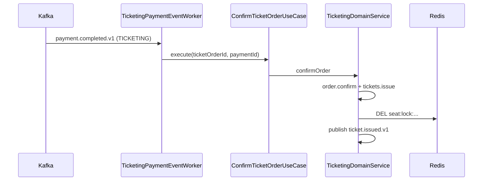
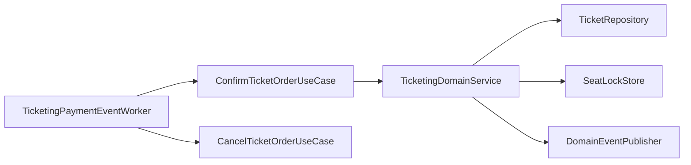

# [TICKETING-06] payment.completed consumer → 티켓 발권

## 작업 내용 (설계 의도)

### 변경 사항

`presentation/consumer/PaymentEventWorker`(혹은 TicketingPaymentEventWorker)에서 `payment.completed.v1` / `payment.failed.v1` 구독.

`payment.completed.v1` (orderType=TICKETING):
1. `ConfirmTicketOrderUseCase.execute(ticketOrderId, paymentId)`.
2. DomainService가 TicketOrder.confirm → Ticket 일괄 발권 + Seat 락 해제(`DEL seat:lock:...`).
3. `ticket.issued.v1` 이벤트 발행. 페이로드는 알림 템플릿 렌더링에 필요한 정보를 모두 포함:
   ```json
   {
     "ticketIds": [1001, 1002],
     "userId": 7,
     "eventId": 42,
     "eventTitle": "두산 vs LG 6/1",
     "venue": "잠실야구장",
     "startsAt": "2026-06-01T18:30:00+09:00",
     "seats": [
       {"section": "A", "rowNo": "12", "seatNo": "5", "price": 35000},
       {"section": "A", "rowNo": "12", "seatNo": "6", "price": 35000}
     ]
   }
   ```
   페이로드 구성을 위해 DomainService가 Event + Seat 정보를 함께 조회한다.

`payment.failed.v1` (orderType=TICKETING):
1. `CancelTicketOrderUseCase` 호출. TicketOrder.cancel.
2. **Seat 락 즉시 해제** — DomainService가 TicketOrder의 lockedSeatIds를 조회해 `seat:lock:{eventId}:{seatId}` 키를 DEL. TTL 자연 해제를 기다리지 않음 (사용자 재시도 차단 해소).
3. 락 해제 실패(이미 만료)는 무시(멱등).

멱등성: TicketOrder.status가 이미 CONFIRMED/CANCELLED면 noop.

> TicketOrder에 락 정보(eventId, seatIds)를 PENDING 단계부터 보관해야 락 해제가 가능. TICKETING-03에 `ticket_orders.locked_event_id`, `locked_seat_ids` JSON 컬럼 추가.

## 다이어그램

### 처리 흐름



### 클래스 의존



## 테스트 케이스

### 단위 테스트 (Unit)
| ID | 대상 | 케이스 |
|---|---|---|
| U-01 | `ConfirmTicketOrderUseCase` | 이미 CONFIRMED 상태에 대해 멱등 noop 처리된다 |
| U-02 | `TicketingPaymentEventWorker` | orderType ≠ TICKETING 이벤트는 무시한다 |
| U-03 | `ticket.issued.v1` 페이로드 | ticketIds 배열, userId, eventId 3개 필드가 포함된다 |

### 레포지토리 테스트 (Repository / Persistence)
| ID | 대상 | 케이스 |
|---|---|---|
| R-01 | 트랜잭션 원자성 | Tickets 일괄 INSERT + Redis 락 해제가 원자적으로 처리된다 |
| R-02 | 트랜잭션 롤백 | Ticket unique 제약 위반 시 트랜잭션 전체가 롤백되어 TicketOrder가 PENDING으로 유지된다 |

### 시나리오 테스트 (Scenario / Integration)
| ID | 시나리오 | 케이스 |
|---|---|---|
| S-01 | 결제→발권 흐름 | `payment.completed.v1` 발행 후 5초 내 CONFIRMED + Tickets ISSUED + 락 해제 + `ticket.issued.v1` 발행 |
| S-02 | 멱등성 | 동일 이벤트 두 번 발행해도 발권/이벤트 모두 1회만 처리된다 |
| S-03 | 결제 실패 시 즉시 락 해제 | `payment.failed.v1` 발행 시 5초 내 TicketOrder CANCELLED + Redis 좌석 락 DEL 완료되어 즉시 재시도 가능 |
| S-04 | 만료된 락 멱등 해제 | 결제 실패 시점에 이미 TTL 만료된 락은 무시되고 TicketOrder만 CANCELLED 처리된다 |
