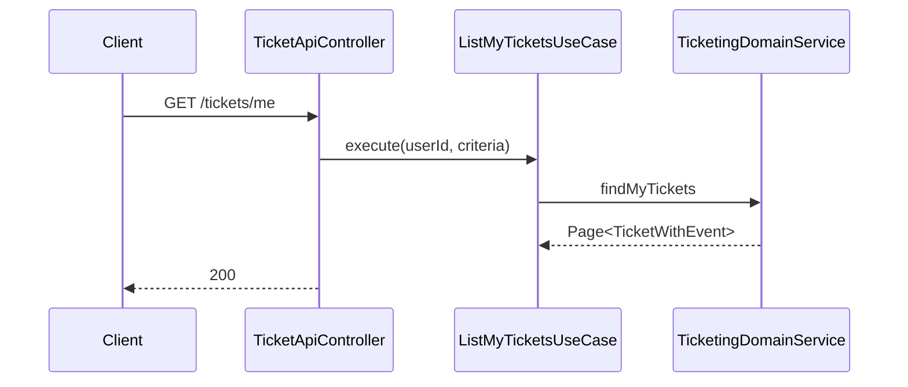
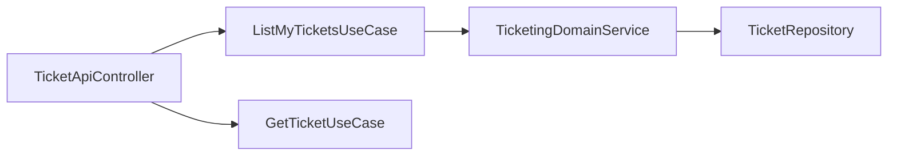

# [TICKETING-07] 사용자 보유 티켓 조회 API

## 작업 내용 (설계 의도)

### 변경 사항

`GET /tickets/me` — 본인 보유 티켓 목록 (Event 정보 포함). 페이지네이션 + 상태 필터(ISSUED/REVOKED).

`GET /tickets/{id}` — 단건. QR 코드 표시용 `code` 반환. 본인 티켓만 조회 가능.

`ListMyTicketsUseCase`, `GetTicketUseCase`. QueryDSL CustomRepository로 `Ticket × TicketOrder × Event` JOIN (도메인 내부 JOIN이므로 허용, 외부 도메인 JOIN은 금지).

Event 정보(title, venue, startsAt)를 함께 반환하기 위해 응답 DTO에서 합산.

## 다이어그램

### 처리 흐름

### 클래스 의존

## 테스트 케이스

### 단위 테스트 (Unit)
| ID | 대상 | 케이스 |
|---|---|---|
| U-01 | `ListMyTicketsUseCase` | SecurityContext userId로 필터링하고 다른 사용자 데이터는 노출되지 않는다 |
| U-02 | `TicketResponseMapper` | Event 정보(title, venue, startsAt)가 정확히 매핑된다 |

### 레포지토리 테스트 (Repository / Persistence)
| ID | 대상 | 케이스 |
|---|---|---|
| R-01 | 3-way JOIN | Ticket × TicketOrder × Event JOIN이 N+1 없이 단일 쿼리로 동작한다 |
| R-02 | 페이지네이션 | Event.startsAt desc 안정 정렬로 동작한다 |
| R-03 | 인덱스 사용 | ISSUED 상태 필터가 `(ticket_order_id, status)` 인덱스를 사용한다 |

### 시나리오 테스트 (Scenario / Integration)
| ID | 시나리오 | 케이스 |
|---|---|---|
| S-01 | 본인 티켓 조회 | `GET /tickets/me?status=ISSUED`는 본인 ISSUED만 반환한다 |
| S-02 | 단건 인가 | 단건 응답에 `code` 필드가 포함되고 타인 조회 시 403이다 |
| S-03 | REVOKED 노출 | 기본 응답에서 REVOKED는 제외되고 명시적 status 지정 시만 노출된다 |
