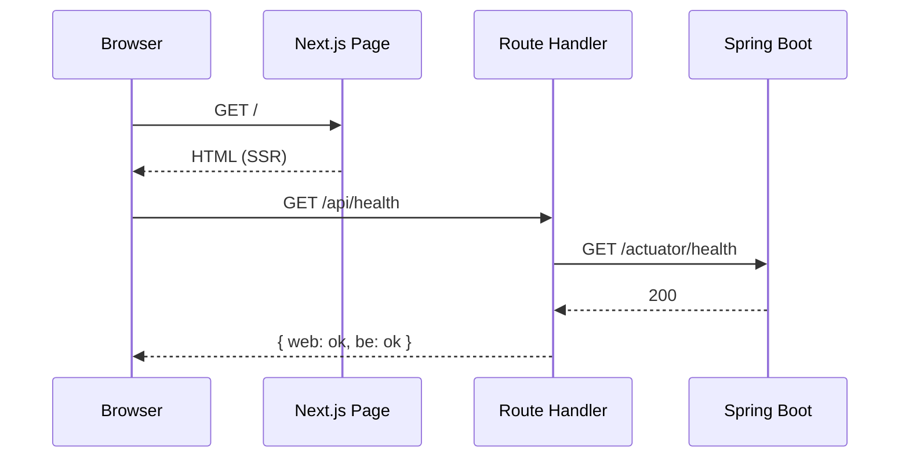
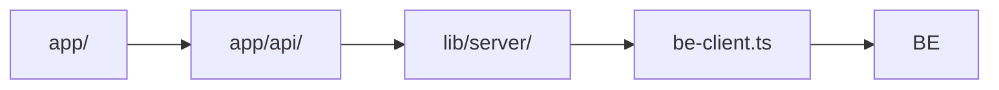

# [WEB-01] Next.js 14 부트스트랩 + BFF 골격

## 작업 내용 (설계 의도)

### 변경 사항

`sports-application-web` 신규 레포에 Next.js 14 App Router 기반 골격을 구성한다. TypeScript strict, ESLint, Prettier, Vitest, Playwright 설정. Tailwind + shadcn/ui CLI 적용.

BFF 골격: `app/api/<도메인>/...` Route Handler를 도메인별 디렉토리로 분리. 모든 외부 BE 호출은 `lib/server/be-client.ts` 단일 인스턴스를 거치며 JWT는 httpOnly 쿠키에서 추출해 Authorization 헤더로 전달.

ENV: `BACKEND_URL`(서버 전용), `NEXT_PUBLIC_APP_NAME` 등. 시크릿 평문 커밋 금지.

본 티켓에서는 `/` 랜딩 페이지(공지 + 헬스 체크 안내)와 `/api/health` BFF 헬스 라우트만 동작.

## 다이어그램

### 처리 흐름

### 클래스 의존

## 테스트 케이스

### 단위 테스트 (Unit)
| ID | 대상 | 케이스 |
|---|---|---|
| U-01 | `lib/server/be-client.ts` | JWT 쿠키 부재 시 요청에 Authorization 헤더가 포함되지 않는다 |
| U-02 | `lib/server/be-client.ts` | BACKEND_URL 환경 변수 누락 시 부팅 단계에서 명확한 에러를 던진다 |

### 레포지토리 테스트 (Repository / Persistence)
| ID | 대상 | 케이스 |
|---|---|---|
| R-01 | — | Web 트랙은 자체 DB 없음. 해당 없음 |

### 시나리오 테스트 (Scenario / Integration)
| ID | 시나리오 | 케이스 |
|---|---|---|
| S-01 | 부팅 확인 | `npm run dev` 후 `GET /`이 200 응답을 반환한다 |
| S-02 | BFF 헬스 | `GET /api/health`가 web/be 두 상태를 합산해 200을 반환한다 (BE mock) |
