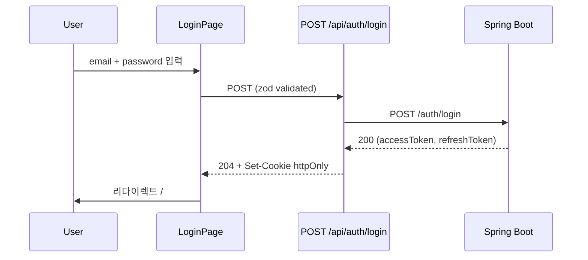

# [WEB-02] 가입·로그인·로그아웃 화면 + BFF

## 작업 내용 (설계 의도)

### 변경 사항

`app/(auth)/login/page.tsx`, `app/(auth)/register/page.tsx` 페이지. react-hook-form + zod로 입력 검증.

BFF:
- `POST /api/auth/login` → BE `POST /auth/login` 호출 → accessToken을 httpOnly secure SameSite=lax 쿠키에 저장, refreshToken은 별도 쿠키.
- `POST /api/auth/logout` → BE `POST /auth/logout` + 쿠키 제거.
- `POST /api/users/register` → BE `POST /users/register` 그대로 위임.

클라이언트가 토큰을 다루지 않도록 쿠키 기반 인증. CSRF 대응을 위해 Same-site=strict + 별도 CSRF 토큰(Double Submit Cookie 또는 Origin 헤더 검증).

미인증 사용자가 보호 경로 접근 시 middleware에서 `/login`으로 리다이렉트.

## 다이어그램

### 처리 흐름



### 클래스 의존

```mermaid
flowchart LR
    LoginPage --> LoginForm
    LoginForm --> useLoginMutation
    useLoginMutation -.->|fetch.-> BFFAuthRoute
    BFFAuthRoute --> BeClient
    Middleware -.checks.-> AuthCookie
```

## 테스트 케이스

### 단위 테스트 (Unit)
| ID | 대상 | 케이스 |
|---|---|---|
| U-01 | `LoginSchema` (zod) | 잘못된 이메일 형식 입력 시 validation error를 반환한다 |
| U-02 | `useLoginMutation` | onError 콜백에서 InvalidCredentials 응답을 식별 메시지로 변환한다 |
| U-03 | `authMiddleware` | 미인증 사용자가 `/me` 접근 시 `/login`으로 리다이렉트한다 |

### 레포지토리 테스트 (Repository / Persistence)
| ID | 대상 | 케이스 |
|---|---|---|
| R-01 | — | BFF만 통과하므로 별도 Repository 없음 |

### 시나리오 테스트 (Scenario / Integration)
| ID | 시나리오 | 케이스 |
|---|---|---|
| S-01 | 정상 로그인 (Playwright) | 폼 입력 → 제출 → / 리다이렉트 + 헤더에 사용자 닉네임 노출 |
| S-02 | 실패 메시지 | 잘못된 비밀번호 시 "비밀번호가 일치하지 않습니다" 메시지가 표시된다 |
| S-03 | 쿠키 보안 | Set-Cookie 헤더에 HttpOnly·Secure·SameSite=Lax 속성이 포함된다 |
| S-04 | 로그아웃 | 로그아웃 후 보호 경로 접근 시 `/login`으로 리다이렉트된다 |
