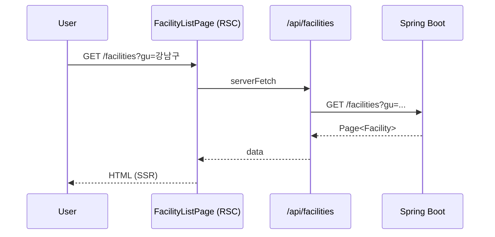
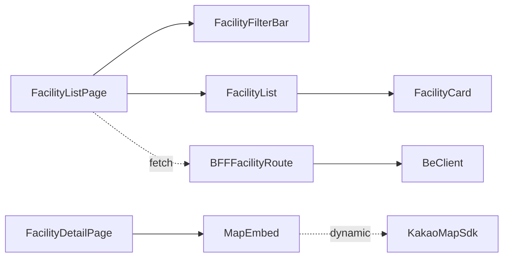

# [WEB-03] 시설 검색·단건 화면

## 작업 내용 (설계 의도)

### 변경 사항

`app/(public)/facilities/page.tsx` 검색 페이지. URL Search Params로 필터 상태 관리(`?gu=...&type=...&page=...`). 페이지 컴포넌트는 RSC에서 BFF 호출 후 초기 데이터 렌더. 추가 페이지 이동은 클라이언트 컴포넌트에서 TanStack Query.

`app/(public)/facilities/[id]/page.tsx` 단건. 지도(KakaoMap/NaverMap 라이브러리 한 가지 선택) 렌더. 지도 SDK는 dynamic import + ssr:false.

BFF:
- `GET /api/facilities` → `GET /facilities`
- `GET /api/facilities/[id]` → `GET /facilities/{id}`
- `GET /api/facilities/stats/gu-type` → 동일

검색 입력은 디바운싱 300ms.

## 다이어그램

### 처리 흐름

### 클래스 의존

## 테스트 케이스

### 단위 테스트 (Unit)
| ID | 대상 | 케이스 |
|---|---|---|
| U-01 | `FacilityFilterBar` | gu/type 변경 시 URL search params가 갱신된다 |
| U-02 | `useFacilityList` | 동일 검색 조건 두 번 호출 시 TanStack Query 캐시에서 가져온다 (네트워크 호출 X) |
| U-03 | `debounceSearch` | 300ms 내 다중 입력은 1회 fetch만 트리거한다 |

### 레포지토리 테스트 (Repository / Persistence)
| ID | 대상 | 케이스 |
|---|---|---|
| R-01 | — | 별도 Repository 없음 |

### 시나리오 테스트 (Scenario / Integration)
| ID | 시나리오 | 케이스 |
|---|---|---|
| S-01 | 검색 결과 표시 (Playwright) | gu/type 필터 변경 시 결과 카드 목록이 갱신된다 |
| S-02 | 페이지네이션 | 페이지 이동 시 URL과 결과가 동기화되고 새로고침 시 동일 상태로 복원된다 |
| S-03 | 단건+지도 | `/facilities/{id}` 진입 시 지도 SDK가 ssr 단계에서 로드되지 않음을 검증한다 (initial JS bundle 검사) |
